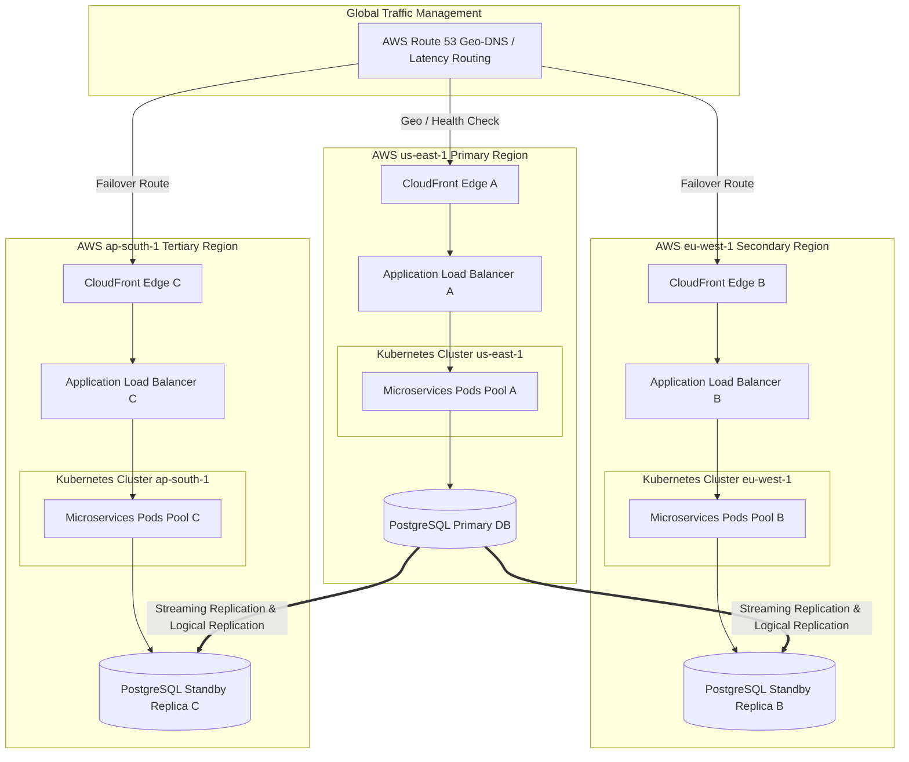
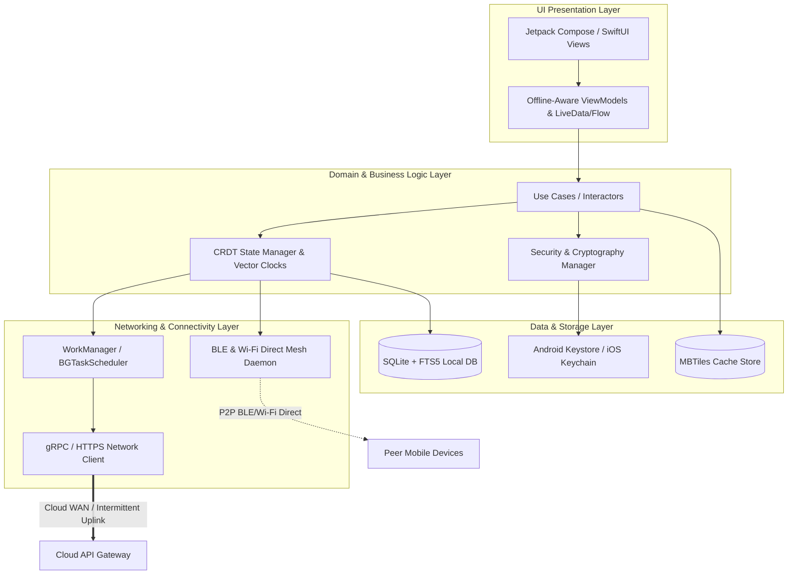
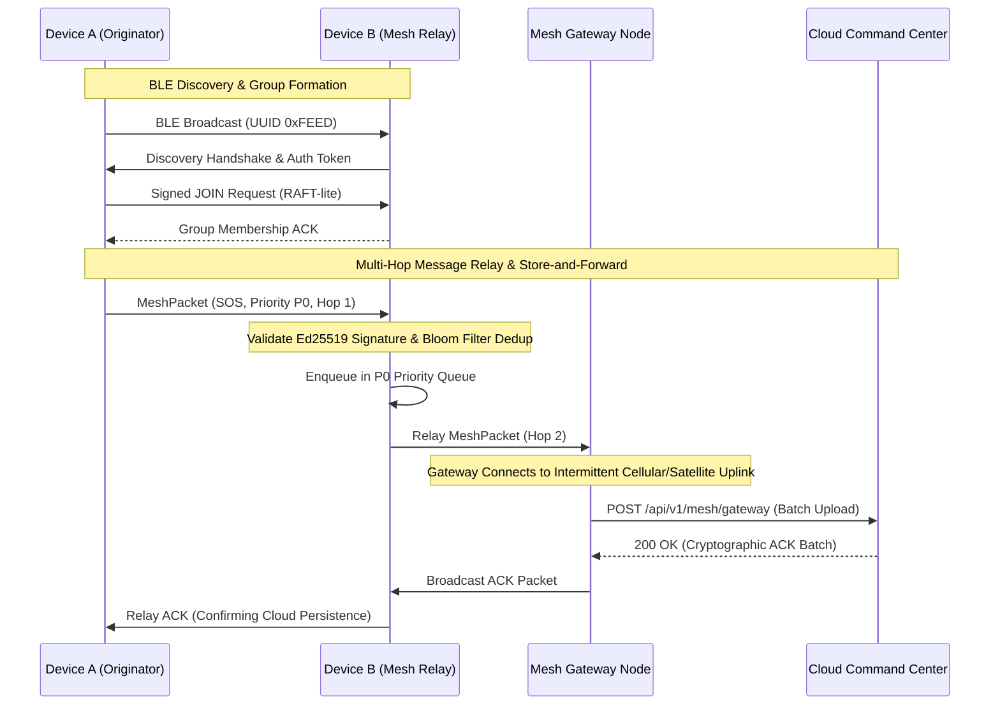
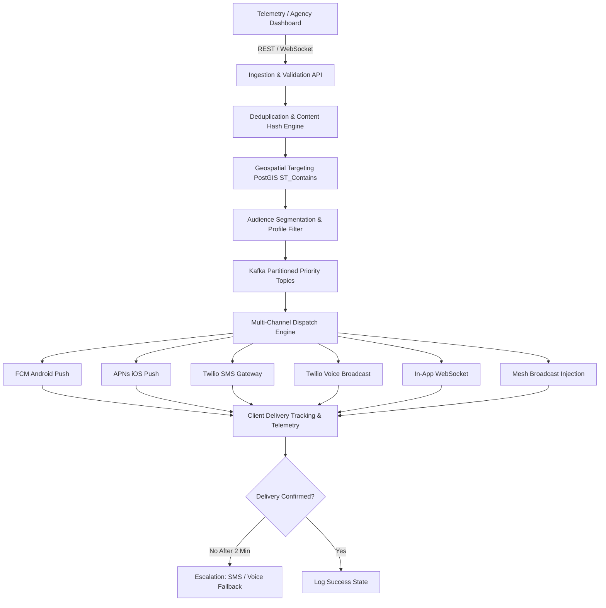
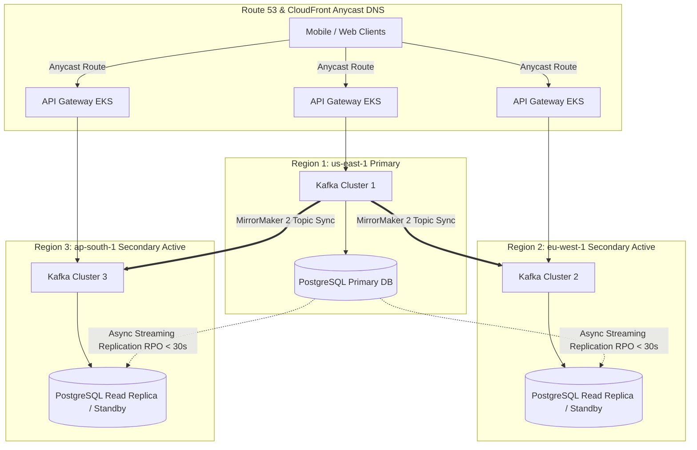
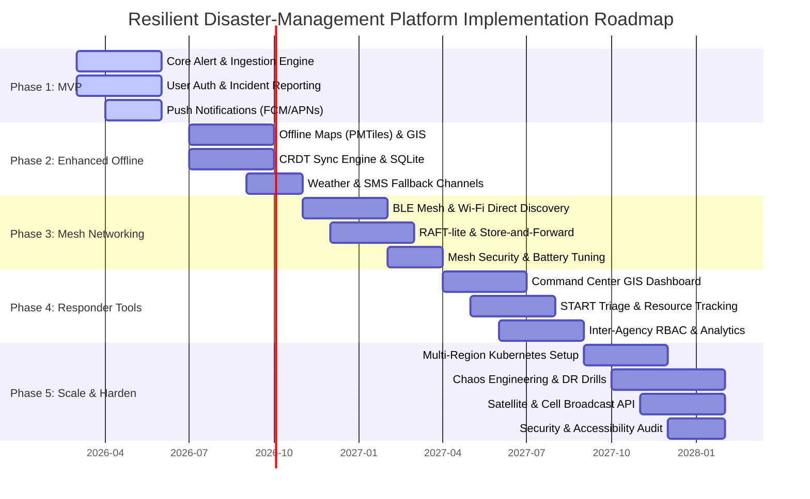

# Resilient Disaster-Management Platform (RDMP): Enterprise System Design Document

> **A Scalable, Resilient, Secure, and Offline-First Disaster-Management Platform for Mobile Devices**

---

## Table of Contents

1. [System Scope, Assumptions, Users, Actors, and Key Use Cases](#section-1-system-scope-assumptions-users-actors-and-key-use-cases)

1. [Functional and Non-Functional Requirements](#section-2-functional-and-non-functional-requirements)

1. [Core Technical Architecture and High-Level Design](#section-3-core-technical-architecture--high-level-design)

1. [Service Decomposition](#section-4-service-decomposition)

1. [Mobile Application Architecture](#section-5-mobile-application-architecture)

1. [Mesh Network Protocol Design](#section-6-mesh-network-protocol-design)

1. [Alerting and Mass Notification Architecture](#section-7-alerting-and-mass-notification-architecture)

1. [Technology Recommendations with Trade-offs](#section-8-technology-recommendations-with-trade-offs)

1. [Data Models and API Contracts](#section-9-data-models-and-api-contracts)

1. [Network Partitions, Failure Handling, and Conflict Resolution](#section-10-network-partitions-failure-handling-and-conflict-resolution)

1. [Security Model](#section-11-security-model)

1. [Privacy, Consent, Location-Data Protection, Data Retention, and Regulatory Considerations](#section-12-privacy-consent-location-data-protection-data-retention-and-regulatory-considerations)

1. [Deployment Architecture, Multi-Region Disaster Recovery, Capacity Planning, Autoscaling, and Observability](#section-13-deployment-architecture-multi-region-disaster-recovery-capacity-planning-autoscaling-and-observability)

1. [Capacity Estimates](#section-14-capacity-estimates)

1. [Trade-offs, Risks, Bottlenecks, and Failure Modes](#section-15-trade-offs-risks-bottlenecks-and-failure-modes)

1. [Incremental Implementation Roadmap](#section-16-incremental-implementation-roadmap)

1. [Example User Journeys](#section-17-example-user-journeys)

1. [Conclusion](#final-section-conclusion)

1. [References](#references)

---

# Enterprise System Design Document: Resilient, Scalable, Secure, and Offline-First Disaster-Management Platform

## Part 1: Sections 1 through 5 (Foundations, Architecture, Services, and Mobile Client)

---

## Section 1: System Scope, Assumptions, Users, Actors, and Key Use Cases

### 1.1 Executive Summary and System Scope

Modern disaster management requires an ultra-resilient, fault-tolerant infrastructure capable of operating under extreme degradation of public communication networks. When natural disasters—such as earthquakes, hurricanes, floods, and wildfires—strike, traditional cellular towers, fiber-optic backbones, and municipal power grids frequently fail. The **Resilient Disaster-Management Platform (RDMP)** is engineered as a zero-trust, offline-first, mobile-centric ecosystem designed to sustain life-safety operations, coordinate emergency responders, aggregate crowd-sourced situational awareness, and synchronize critical telemetry across disconnected, intermittent, and high-latency topologies.

The platform's scope encompasses five operational phases: **Mitigation, Preparedness, Response, Recovery, and Auditing**. It guarantees deterministic local execution on mobile devices without active internet connectivity while seamlessly bridging local peer-to-peer (P2P) mesh networks with centralized cloud clusters once backhaul connectivity is restored.

---

### 1.2 System Actors and User Personas

The ecosystem serves a diverse taxonomy of actors, each requiring tailored access controls, user interfaces, bandwidth optimization profiles, and trust levels.

1. **Residents (End Users / Citizens)**: Individuals in disaster-affected or vulnerable regions. They receive emergency alerts, submit SOS distress beacons, report localized hazards (e.g., blocked roads, structural collapses), access offline shelter maps, and check-in as safe with family members.

1. **Community Leaders (Wardens / Neighborhood Coordinators)**: Trusted local volunteers equipped with elevated device permissions. They aggregate local headcount data, manage neighborhood muster points, triage localized incidents before official responders arrive, and relay localized mesh packets.

1. **Emergency Responders (Fire, Police, Medical Personnel)**: First responders operating in the field. They require real-time incident routing, secure tactical voice/text communication, offline GIS floor plans, patient triage tagging (START methodology), and direct asset tracking.

1. **Government Agencies (Municipal, State, Federal Emergency Management)**: Command and control personnel. They establish operational perimeters, issue mandatory evacuation orders, broadcast region-wide emergency alerts, allocate heavy resources, and coordinate inter-agency interoperability.

1. **Non-Governmental Organizations (NGOs & Relief Charities)**: Humanitarian organizations providing aid, food, medical supplies, and shelter management. They track supply chain inventories, coordinate shelter capacity, and record beneficiary distributions.

1. **System Administrators**: Technical operators responsible for platform health, cryptographic key lifecycle management, database sharding, geo-replication policies, and emergency broadcast authorization overrides.

1. **Automated Monitoring Systems**: IoT sensors, seismic networks, satellite weather feeds, river gauge monitors, and AI telemetry scrapers that ingest unstructured or structured telemetry to trigger automated programmatic alerts.

---

### 1.3 Explicit System Assumptions

To bound the architectural complexity and define operational parameters, the platform relies on 16 foundational assumptions:

1. **Cellular and Internet Blackouts**: Primary telecommunication backhauls (LTE/5G, fiber, public cloud endpoints) may experience 100% packet loss or total unavailability for extended periods (72+ hours) in disaster zones.

1. **Device Hardware Heterogeneity**: Client devices range from high-end ruggedized tactical tablets to legacy Android (Android 10+) and iOS devices with constrained RAM (2GB–4GB), limited storage, and degraded battery health.

1. **Power Grid Failures**: Municipal electrical grids will fail; mobile devices and local mesh relay nodes must operate on internal batteries, vehicle auxiliary power, or portable solar chargers, necessitating aggressive duty-cycling.

1. **Peer-to-Peer Radio Availability**: Bluetooth Low Energy (BLE), Wi-Fi Direct, and Apple Multipeer Connectivity hardware remain functional on client devices regardless of cellular network status.

1. **Asymmetric Bandwidth and High Latency**: When satellite backhaul (e.g., Starlink, BGAN) or intermittent microwave links are active, bandwidth is severely constrained (kilobits to low megabits per second shared across thousands of users) with high jitter and round-trip times (RTT > 800ms).

1. **Malicious Actor and Compromised Node Presence**: The platform operates in a hostile environment where physical devices may be captured, and malicious actors may attempt to inject false telemetry, execute denial-of-service attacks, or spoof emergency broadcasts.

1. **Geospatial Proximity**: Local coordination relies heavily on device-computed GPS, GLONASS, Galileo positioning, and offline vector/raster tile packages pre-loaded or sideloaded onto devices.

1. **Asynchronous Eventually Consistent State**: Real-time synchronization is impossible during partitioning; the system must adopt conflict-free replicated data types (CRDTs) and vector clocks to achieve eventual consistency upon reconnection.

1. **Regulatory Compliance Standards**: The platform must adhere to strict data privacy mandates (GDPR, HIPAA for medical triage data) while permitting emergency exemptions for life-safety data disclosure.

1. **Storage Constraints**: Local mobile storage is bounded; devices cannot store global historical GIS data and must utilize intelligent sliding-window caching and LRU eviction for non-critical datasets.

1. **Cryptographic Key Pre-Distribution**: Critical cryptographic trust roots and public keys for emergency authorities are securely pre-provisioned on devices during initial app installation and updated via signed OTA packages.

1. **Multi-Tenant Isolation**: Government agencies, NGOs, and enterprise municipal clients operate within strictly segregated logical tenants sharing a common resilient underlying fabric.

1. **Clock Drift**: Mobile device clocks may experience significant drift due to lack of NTP synchronization during cellular blackouts; algorithms must be designed to tolerate logical timestamps and vector clocks rather than relying on wall-clock synchronization.

1. **Multilingual and Low-Literacy Demographics**: Affected populations span diverse linguistic groups and varying literacy levels, necessitating icon-driven UIs, audio announcements, and multi-language support embedded locally.

1. **Regulatory Emergency Override Authority**: Authorized government agencies possess cryptographic signing tokens capable of overriding local client notification filters to broadcast mandatory life-safety alerts.

1. **Satellite SMS/Messaging Integration**: Devices equipped with hardware satellite capabilities (e.g., Apple Emergency SOS via Satellite, Qualcomm Snapdragon Satellite) can transmit low-payload burst packets upstream.

---

### 1.4 Key Use Cases

The platform fulfills 12 core use cases categorized across the disaster lifecycle:

| Category | ID | Use Case Name | Description |
| --- | --- | --- | --- |
| **Preparedness** | UC-01 | Offline Resource & Shelter Pre-Caching | Residents and responders pre-download offline vector maps, evacuation routes, first-aid manuals, and emergency shelter locations before a disaster strikes. |
| **Preparedness** | UC-02 | Household Emergency Plan Synchronization | Families establish decentralized emergency contact trees and rendezvous points that sync peer-to-peer across local devices. |
| **Active Disaster** | UC-03 | Zero-Click Emergency SOS Broadcasting | A trapped resident triggers an SOS beacon that broadcasts over BLE mesh to neighboring devices, which relay it outward until reaching a connected gateway. |
| **Active Disaster** | UC-04 | Automated Seismic & Weather Early Warning | IoT seismic sensors detect primary wave anomalies and trigger sub-second regional push notifications before secondary destructive waves arrive. |
| **Active Disaster** | UC-05 | Offline Mesh-Based Tactical Chat | Emergency responders in subterranean or dead-zone environments communicate via encrypted peer-to-peer multi-hop text and voice messages. |
| **Active Disaster** | UC-06 | Crowd-Sourced Hazard & Damage Reporting | Citizens capture geo-tagged photos and structural damage assessments that sync locally via CRDTs and populate the command GIS dashboard when online. |
| **Active Disaster** | UC-07 | Triage and Patient Tracking | Medical responders utilize offline START triage forms on tablets, generating cryptographically signed local records that reconcile upon cloud reconnection. |
| **Active Disaster** | UC-08 | Mandatory Evacuation Geofence Alerts | Government agencies define polygonal geofences; devices entering the zone offline trigger mandatory audio-visual evacuation directives. |
| **Post-Disaster** | UC-09 | Safe Check-In and Welfare Broadcasting | Displaced residents broadcast cryptographically signed "I am safe" beacons that propagate across the mesh to notify relatives via eventual cloud sync. |
| **Post-Disaster** | UC-10 | Aid and Supply Distribution Tracking | NGOs scan cryptographic beneficiary QR codes offline to log food, water, and medical supply distributions, resolving inventory conflicts later. |
| **Post-Disaster** | UC-11 | Post-Event Telemetry & Forensic Audit | System administrators extract tamper-evident audit logs from mesh sync nodes to reconstruct incident response timelines and resource allocations. |
| **Post-Disaster** | UC-12 | Dynamic Shelter Capacity Management | Shelter managers update live bed and medical supply capacities locally, broadcasting updates across the mesh to redirect incoming evacuees. |

---

## Section 2: Functional and Non-Functional Requirements

### 2.1 Categorized Functional Requirements

#### FR-1: Emergency Alerting and Early Warning

- **FR-1.1**: The system must ingest raw telemetry from seismic, meteorological, and hydrological feeds via Kafka and convert them into standardized Common Alerting Protocol (CAP v1.2) XML/JSON structures.

- **FR-1.2**: The Alert Service must evaluate incoming alerts against spatial geofences and subscriber profiles within **< 200ms** of ingestion.

- **FR-1.3**: The platform must support broadcast overrides that bypass user Do-Not-Disturb and silent modes for life-threatening mandatory evacuation orders.

#### FR-2: Offline-First Geospatial Mapping and Navigation

- **FR-2.1**: Mobile clients must render vector and raster maps (MBTiles / PMTiles format) entirely offline without active internet connectivity.

- **FR-2.2**: The GIS engine must compute local routing graphs offline, avoiding reported road closures, flooding zones, and structural debris hazards synchronized via mesh peers.

#### FR-3: Peer-to-Peer Mesh Networking and Relaying

- **FR-3.1**: Mobile applications must maintain a background BLE and Wi-Fi Direct multi-hop mesh network capable of routing small telemetry packets (SOS, chat, check-ins) across disconnected nodes up to **6 hops** deep.

- **FR-3.2**: The Mesh Gateway service must automatically bridge peer-to-peer mesh packets to the cloud backbone whenever an intermittent cellular, Wi-Fi, or satellite uplink becomes available.

#### FR-4: Incident Management and Triage

- **FR-4.1**: Responders must be able to create, update, and close incident tickets (fire, medical, rescue, infrastructure failure) while offline.

- **FR-4.2**: The Incident Service must implement strict role-based access control (RBAC) ensuring only authorized medical personnel can modify patient triage classification data.

#### FR-5: Asynchronous Data Synchronization and Conflict Resolution

- **FR-5.1**: The Sync Engine must reconcile divergent local database states with server databases using operation-based and state-based CRDTs without data loss or manual user intervention for commutative operations.

- **FR-5.2**: The synchronization queue must prioritize traffic based on payload urgency: Life-Safety (SOS/Triage) > Tactical Chat > GIS Updates > Telemetry Logs.

---

### 2.2 Non-Functional Requirements Ranking

Non-functional requirements are ranked by operational criticality (Priority 1 being highest mission-criticality).

| Rank | Dimension | Requirement Specification | Target Metric / Threshold |
| --- | --- | --- | --- |
| **1** | **Disaster Resilience** | System must maintain core life-safety operations (local SOS, mesh chat, offline maps) during 100% WAN disconnection. | 100% local functional uptime during network partition. |
| **2** | **Availability** | Cloud-backed API gateway and core microservices must maintain high availability across multi-region deployments. | 99.999% availability ($$< 5.26$$ minutes downtime/year). |
| **3** | **Offline Capability** | All critical preparedness, navigation, and triage workflows must execute entirely on-device without network calls. | Zero dependency on external network for core survival functions. |
| **4** | **Scalability** | Platform must ingest and process massive concurrent spikes during regional disaster events. | Support $$5,000,000$$ concurrent connected clients and $$500,000$$ mesh-relayed SOS events/sec. |
| **5** | **Performance & Latency** | End-to-end cloud notification dispatch and critical mesh relay latency. | P99 latency $$< 1.5\text{s}$$ online; mesh relay hop-to-hop latency $$< 800\text{ms}$$. |
| **6** | **Reliability & Data Integrity** | Zero data loss for local transactional writes; guaranteed eventual consistency upon WAN reconnection. | $$0\%$$ unrecoverable sync data loss; cryptographic hash verification on all records. |
| **7** | **Security & Encryption** | End-to-end encryption (E2EE) for all peer-to-peer and cloud communications; tamper-evident logging. | AES-256-GCM at rest; TLS 1.3 in transit; Ed25519 digital signatures. |
| **8** | **Privacy & Compliance** | Strict anonymization of non-emergency telemetry; HIPAA compliance for patient triage records; GDPR right-to-forget post-crisis. | 100% compliance with HIPAA/GDPR data masking standards. |
| **9** | **Battery Efficiency** | Mobile background daemons must optimize radio duty cycles to preserve battery life during extended blackouts. | Background CPU usage $$< 2\%$$; active BLE mesh scanning battery drain $$< 3\%$$/hour. |
| **10** | **Accessibility** | UI must support WCAG 2.1 AA standards, high-contrast disaster modes, screen readers, and low-bandwidth voice notes. | Full compliance with accessibility standards across iOS and Android. |
| **11** | **Observability** | Comprehensive telemetry collection, distributed tracing, and audit logging across cloud and edge nodes. | 100% trace coverage via OpenTelemetry; real-time anomaly detection. |
| **12** | **Maintainability** | Microservices architecture with automated CI/CD pipelines, chaos engineering testing, and modular contracts. | Mean Time to Recovery (MTTR) $$< 15$$ minutes for microservice degradation. |

---

## Section 3: Core Technical Architecture & High-Level Design

### 3.1 High-Level System Architecture Diagram

The following Mermaid architecture diagram illustrates the end-to-end topology of the Resilient Disaster-Management Platform, spanning mobile client layers, mesh networking fabrics, edge gateways, cloud microservices, and persistence tiers.

```mermaid
graph TB
    subgraph Mobile Client Tier [Mobile Client Tier - iOS / Android]
        MC1[Resident App]
        MC2[Responders App]
        MC3[Admin App]
        SQLite[(Local SQLite + FTS5)]
        CRDT[CRDT Sync Engine]
        BLE[BLE / Wi-Fi Direct Mesh Daemon]
    end

    subgraph Edge & Mesh Relay Tier [Edge & Mesh Relay Tier]
        GW_Node[Gateway Mobile Node / Sat-Link Terminal]
        IoT[IoT Seismic / Weather Sensors]
    end

    subgraph Cloud Infrastructure Tier [AWS / Multi-Region Cloud Infrastructure]
        subgraph Edge & CDN [Edge & API Gateway]
            CloudFront[AWS CloudFront CDN]
            APIGW[Kong API Gateway / Load Balancer]
        end

        subgraph Microservices Tier [Containerized Microservices - EKS]
            AlertSvc[Alert Service]
            NotifSvc[Notification Dispatch Service]
            AuthSvc[User & Auth Service]
            IncidentSvc[Incident Management Service]
            GIS_Svc[Map & GIS Service]
            WeatherSvc[Weather Service]
            MeshGW[Mesh Gateway Service]
            SyncSvc[Sync Engine Service]
            AdminSvc[Admin & Audit Service]
            ObservSvc[Analytics & Observability Service]
        end

        subgraph Messaging & Event Bus [Event Streaming & Broker]
            Kafka[Apache Kafka Cluster]
            Redis[(Redis Cluster - PubSub / Cache)]
        end

        subgraph Persistence Tier [Data Persistence & Storage]
            PG[(PostgreSQL + PostGIS)]
            TS[(TimescaleDB - Telemetry)]
            ES[(Elasticsearch - Logs & Search)]
            S3[(AWS S3 - GIS Tiles & Media)]
        end
    end

    subgraph External Provider Tier [External Providers]
        FCM[Firebase Cloud Messaging]
        APNs[Apple Push Notification service]
        Twilio[Twilio SMS / Satellite Gateway]
        ExtWeather[National Weather Service APIs]
    end

    %% Client internal linkages
    MC1 --> SQLite
    MC2 --> SQLite
    MC3 --> SQLite
    SQLite --> CRDT
    CRDT --> BLE
    
    %% Mesh & Edge routing
    BLE -.->|P2P Multi-hop Mesh| GW_Node
    IoT -->|MQTT / HTTP| MeshGW
    GW_Node ==>|Intermittent Uplink / Satellite| APIGW

    %% Client to Cloud
    MC1 ==>|HTTPS / gRPC| APIGW
    MC2 ==>|HTTPS / gRPC| APIGW
    MC3 ==>|HTTPS / gRPC| APIGW

    %% API Gateway to Services
    APIGW --> AlertSvc
    APIGW --> NotifSvc
    APIGW --> AuthSvc
    APIGW --> IncidentSvc
    APIGW --> GIS_Svc
    APIGW --> WeatherSvc
    APIGW --> MeshGW
    APIGW --> SyncSvc
    APIGW --> AdminSvc
    APIGW --> ObservSvc

    %% Service to Event Bus / Cache
    AlertSvc --> Kafka
    IncidentSvc --> Kafka
    MeshGW --> Kafka
    SyncSvc --> Redis
    NotifSvc --> Redis

    %% Service to Persistence
    AlertSvc --> PG
    IncidentSvc --> PG
    AuthSvc --> PG
    GIS_Svc --> S3
    GIS_Svc --> PG
    WeatherSvc --> TS
    ObservSvc --> ES

    %% External integration
    NotifSvc --> FCM
    NotifSvc --> APNs
    NotifSvc --> Twilio
    WeatherSvc --> ExtWeather
```



---

### 3.2 Deployment Architecture Diagram

To withstand catastrophic regional outages (e.g., major earthquake knocking out an entire coastal power grid and data center), the platform is deployed across multiple active-active cloud regions supplemented by regional edge points of presence (PoPs).



---

### 3.3 Detailed Narrative of Architectural Components

#### 1. Client Tier & Offline-First Architecture

The mobile client tier is designed on an **offline-first principle**. All critical business logic, vector GIS rendering, vector tile sets, and incident authoring execute locally against an embedded SQLite database augmented with FTS5 (Full-Text Search). The SQLite store functions as the authoritative single source of truth for the device, eliminating synchronous network dependencies.

#### 2. Peer-to-Peer Mesh Networking Layer

When cellular infrastructure is unavailable, devices automatically bootstrap a localized ad-hoc mesh network utilizing Bluetooth Low Energy (BLE) scanning, advertising, and Wi-Fi Direct protocols. A background daemon packetizes high-priority payloads (SOS beacons, triage updates, check-ins) into compressed binary protocol buffer frames. These frames propagate via multi-hop flooding and epidemic routing algorithms across nearby devices until a node with active internet connectivity (e.g., a satellite terminal, municipal starlink dish, or unaffected border cell tower) bridges the payload into the cloud backbone via the **Mesh Gateway Service**.

#### 3. API Gateway & Edge Ingress Tier

Incoming traffic from millions of mobile clients and edge gateway nodes terminates at **AWS CloudFront** edge locations and hits **Kong API Gateway** instances deployed behind Application Load Balancers. The API Gateway enforces mutual TLS (mTLS), JWT signature verification, rate limiting (token bucket algorithm protecting against denial-of-service storms), and payload schema validation before routing requests to internal microservices via gRPC over HTTP/2.

#### 4. Event Streaming and Asynchronous Messaging Bus

At the heart of the cloud backend lies an enterprise **Apache Kafka cluster**. Decoupled microservices communicate asynchronously via Kafka topics (e.g., `disaster.alerts.raw`, `disaster.incidents.mutations`, `telemetry.iot.stream`). Kafka provides persistent, ordered, replayable commit logs that guarantee no telemetry or incident report is lost during downstream service spikes or database failovers. **Redis Cluster** is utilized for high-speed ephemeral caching, distributed locking, pub-sub channel routing, and rate-limiting counters.

#### 5. Persistence and Storage Tier

The persistence tier is polyglot, tailored to specific data access patterns:

- **PostgreSQL + PostGIS**: Relational storage for user profiles, RBAC roles, tenant metadata, and complex geospatial boundary polygons (evacuation zones, shelter radiuses).

- **TimescaleDB**: Specialized time-series database built on PostgreSQL optimized for high-ingest IoT seismic telemetry, weather data streams, and device heartbeat pings.

- **Elasticsearch**: Decentralized search and log analytics engine indexing audit logs, unstructured incident reports, and system metrics.

- **AWS S3**: Object storage repository hosting immutable binary assets including offline MBTiles map archives, high-resolution damage assessment photos, audio briefing logs, and CAP XML payloads.

---

## Section 4: Service Decomposition

The backend microservices architecture is decomposed into ten domain-driven services. Each service is independently deployable, containerized via Docker, orchestrated via Kubernetes (EKS), and communicates using gRPC for internal inter-service calls and REST/GraphQL for external client egress.

---

### 4.1 Alert Service

- **Core Responsibility**: Ingests, validates, deduplicates, and evaluates emergency alerts (seismic, meteorological, civil defense) against spatial boundaries and user subscription profiles.

- **Technology Stack**: Go (Golang), gRPC, Kafka client, PostGIS, Redis.

- **Scaling Strategy**: Horizontal Pod Autoscaler (HPA) scaling from 5 to 100 pods based on Kafka consumer lag and CPU utilization exceeding 70%.

- **Failure Handling**: Circuit breaker pattern (Istio/Envoy) protecting downstream database dependencies; fallback to local cached alert rule evaluation if database latency spikes $$> 500\text{ms}$$.

- **Key APIs**:
  - `rpc BroadcastAlert (AlertRequest) returns (BroadcastResponse)`
  - `rpc QueryActiveAlerts (AlertQueryFilter) returns (AlertListResponse)`

---

### 4.2 Notification Dispatch Service

- **Core Responsibility**: Orchestrates the multi-channel dispatch of emergency notifications to millions of users concurrently across Push (FCM/APNs), SMS (Twilio), Satellite broadcast, and WebSockets.

- **Technology Stack**: Node.js (TypeScript), Redis (rate-limiting and priority queues), AWS SQS.

- **Scaling Strategy**: Stateless worker pool scaling dynamically based on queue depth in SQS.

- **Failure Handling**: Exponential backoff with jitter retry queues; dead-letter queues (DLQ) for malformed payloads; automatic failover from push notifications to SMS gateway when FCM/APNs ACK timeouts occur.

- **Key APIs**:
  - `rpc DispatchNotification (NotificationPayload) returns (DispatchStatus)`
  - `rpc GetDeliveryReceipts (ReceiptQuery) returns (ReceiptStream)`

---

### 4.3 User & Auth Service

- **Core Responsibility**: Manages user registration, cryptographic identity issuance, role-based access control (RBAC), multi-factor authentication, and OAuth2/OIDC token generation.

- **Technology Stack**: Java (Spring Boot), PostgreSQL, Vault (Secrets Management).

- **Scaling Strategy**: Read replicas for PostgreSQL handling high-frequency token introspection queries; stateless pod scaling.

- **Failure Handling**: Local token caching on clients (JWT with 7-day offline validity signed with platform private keys); graceful degradation to offline mode with cached role permissions.

- **Key APIs**:
  - `rpc AuthenticateUser (AuthCredentials) returns (AuthTokenResponse)`
  - `rpc VerifyPermission (PermissionRequest) returns (PermissionStatusResponse)`

---

### 4.4 Incident Management Service

- **Core Responsibility**: Manages the lifecycle of disaster incident tickets (creation, triage, assignment, status updates, closure) authored by citizens and emergency responders.

- **Technology Stack**: Python (FastAPI), SQLAlchemy, PostgreSQL + PostGIS, Kafka.

- **Scaling Strategy**: CPU-based HPA combined with database connection pooling (PgBouncer).

- **Failure Handling**: Optimistic locking combined with CRDT merge semantics for conflicting incident updates submitted concurrently by disconnected responders.

- **Key APIs**:
  - `rpc CreateIncident (IncidentTicket) returns (IncidentResponse)`
  - `rpc SyncIncidentBatch (BatchIncidentPayload) returns (BatchSyncAck)`

---

### 4.5 Map & GIS Service

- **Core Responsibility**: Serves vector/raster map tiles, computes offline routing graphs, manages evacuation zone polygons, and analyzes spatial intersections.

- **Technology Stack**: Rust (Actix-web), PostGIS, GDAL, AWS S3.

- **Scaling Strategy**: CDN edge caching (CloudFront) for static tile assets; compute-optimized container instances for GIS spatial intersection queries.

- **Failure Handling**: Fallback to local client-cached MBTiles when tile server is unreachable; static bounding-box fallback for route calculations.

- **Key APIs**:
  - `rpc GetMapTiles (TileRequest) returns (TileStream)`
  - `rpc ComputeEvacuationRoute (RouteRequest) returns (RouteResponse)`

---

### 4.6 Weather Service

- **Core Responsibility**: Ingests external meteorological, hydrological, and seismic feeds, normalizes telemetry data, and stores time-series data for predictive modeling.

- **Technology Stack**: Python (Pandas/NumPy), TimescaleDB, Kafka.

- **Scaling Strategy**: Worker pod scaling based on ingestion pipeline throughput.

- **Failure Handling**: Cached historical averages; graceful degradation when external meteorological APIs fail.

- **Key APIs**:
  - `rpc GetCurrentWeatherTelemetry (TelemetryQuery) returns (TelemetryResponse)`
  - `rpc StreamWeatherAlerts (StreamRequest) returns (stream WeatherAlert)`

---

### 4.7 Mesh Gateway Service

- **Core Responsibility**: Acts as the bridge between peer-to-peer mesh relay nodes (via satellite backhaul or intermittent cellular) and the centralized cloud microservices.

- **Technology Stack**: Go, gRPC, Protobuf binary deserialization engines.

- **Scaling Strategy**: Deployed across edge compute nodes and multi-region cloud clusters; autoscaled based on ingress bandwidth utilization.

- **Failure Handling**: Store-and-forward local disk buffering on gateway nodes during complete cloud partition; cryptographic signature verification on all ingested mesh packets to prevent spoofing.

- **Key APIs**:
  - `rpc IngestMeshBatch (MeshBatchPayload) returns (MeshBatchAck)`
  - `rpc RegisterGatewayNode (GatewayRegistration) returns (RegistrationStatus)`

---

### 4.8 Sync Engine Service

- **Core Responsibility**: Manages state synchronization, vector clock comparisons, CRDT state merges, and conflict resolution across distributed offline-first clients.

- **Technology Stack**: Elixir / Phoenix (designed for concurrent state management and real-time streams), Redis, PostgreSQL.

- **Scaling Strategy**: Stateful cluster scaling using Elixir Distributed Node clustering and Redis backend state coordination.

- **Failure Handling**: Automatic reconciliation queues; idempotent transaction processing ensuring duplicate sync packets do not corrupt state.

- **Key APIs**:
  - `rpc SynchronizeState (ClientSyncPayload) returns (ServerSyncResponse)`
  - `rpc ResolveConflict (ConflictResolutionPayload) returns (ResolvedState)`

---

### 4.9 Admin & Audit Service

- **Core Responsibility**: Provides administrative oversight, emergency broadcast authorization overrides, immutable audit logging, and compliance reporting.

- **Technology Stack**: Java (Spring Boot), Elasticsearch, PostgreSQL.

- **Scaling Strategy**: Fixed worker pools with strict access authorization.

- **Failure Handling**: Immutable write-once-read-many (WORM) audit logging to S3 object storage; strict quorum verification for administrative override commands.

- **Key APIs**:
  - `rpc AuthorizeEmergencyOverride (OverrideRequest) returns (OverrideResponse)`
  - `rpc QueryAuditLogs (AuditQueryFilter) returns (AuditLogResponse)`

---

### 4.10 Analytics & Observability Service

- **Core Responsibility**: Collects distributed traces, system metrics, performance logs, and disaster impact telemetry to generate operational health dashboards and post-event analytical reports.

- **Technology Stack**: Go, OpenTelemetry, Prometheus, Grafana, Elasticsearch.

- **Scaling Strategy**: DaemonSet logging agents deployed across all Kubernetes worker nodes; centralized Elasticsearch cluster scaling.

- **Failure Handling**: Local buffer spooling on nodes during network partitions; automatic log rotation and sampling during high-volume spikes.

- **Key APIs**:
  - `rpc IngestTelemetryTrace (TracePayload) returns (TraceAck)`
  - `rpc GetSystemHealthMetrics (HealthQuery) returns (HealthDashboardResponse)`

---

## Section 5: Mobile Application Architecture

The mobile application architecture is engineered specifically for hostile offline environments, high reliability, and minimal battery consumption.

### 5.1 Mobile Client Architecture Diagram



---

### 5.2 Offline Storage Architecture

- **SQLite with FTS5**: The primary on-device database utilizes SQLite compiled with FTS5 (Full-Text Search) to enable lightning-fast local indexing and querying of emergency manuals, incident reports, shelter directories, and offline message histories.

- **Structured Tables**: Key relational schemas include tables for `alerts`, `incidents`, `mesh_messages`, `triage_records`, and `offline_sync_queue`. WAL (Write-Ahead Logging) mode is enabled to ensure crash resilience and non-blocking concurrent reads during background mesh ingestion.

- **GIS Tile Storage**: Vector and raster map tiles are stored in pre-packaged MBTiles SQLite containers, managed via LRU (Least Recently Used) cache eviction policies to respect constrained device storage quotas.

---

### 5.3 Synchronization Engine & Conflict Resolution

- **CRDT-Based Reconciliation**: To handle divergent edits made by disconnected users, the mobile sync engine utilizes **Conflict-Free Replicated Data Types (CRDTs)**. State-based PN-Counters and Last-Write-Wins Element-Sets (LWW-Element-Sets) ensure that concurrent updates to incident statuses or check-in lists converge deterministically across all peers without requiring central server arbitration.

- **Vector Clocks**: Each client maintains a vector clock mapping logical event counters across known peers, enabling the sync engine to identify causal dependencies and concurrency conflicts precisely.

- **Priority Sync Queue**: The local sync queue evaluates and sorts outgoing payloads into 4 distinct priority bands:
    1. **Band 0 (Life-Safety)**: SOS beacons, medical triage records, evacuation panic alerts.
    1. **Band 1 (Tactical)**: Responder chat messages, hazard confirmations.
    1. **Band 2 (Operational)**: Shelter capacity updates, resource requests.
    1. **Band 3 (Background)**: Telemetry logs, analytics traces.

---

### 5.4 Background Processing & Scheduling

- **Android WorkManager**: Utilizes persistent workers configured with strict operational constraints (`NetworkType.CONNECTED` or `NetworkType.METERED`, `RequiresBatteryNotLow`, `RequiresCharging` for heavy syncs) to guarantee background execution of sync tasks even across application reboots or OS restarts.

- **iOS BGTaskScheduler**: Registers background processing and app refresh tasks (`BGProcessingTaskRequest`, `BGAppRefreshTaskRequest`) to periodically flush sync queues and maintain BLE mesh node connectivity while suspended in the background.

---

### 5.5 Local Encryption and Cryptographic Security

- **AES-256-GCM at Rest**: All local SQLite database files, cached tile sets, and sync queues are encrypted at rest using SQLCipher with AES-256-GCM authenticated encryption.

- **Hardware-Backed Key Storage**: Encryption keys and signing keys (Ed25519) are generated within and protected by hardware security modules—**Android Keystore (StrongBox Keymaster)** and **iOS Keychain (Secure Enclave)**. Private keys never leave secure hardware enclaves.

- **Digital Signatures**: Every offline-authored record (SOS, triage tag, check-in) is cryptographically signed by the originating user's private key, ensuring non-repudiation and preventing tampering or injection attacks across the mesh network.

---

### 5.6 Battery Optimization Strategies

- **Adaptive Sync Backoff**: During prolonged network outages, the sync engine exponentially increases backoff intervals (from 30 seconds up to 60 minutes) to prevent aggressive polling and radio wakeups that drain battery.

- **Duty-Cycled BLE Scanning**: To prevent rapid battery depletion from continuous Bluetooth scanning, the mesh daemon employs duty-cycling algorithms (scanning for 5 seconds every 45 seconds under normal conditions, scaling to 15 seconds active during active disaster alert modes).

- **GPS Batching**: Location updates are batched in memory using geofencing APIs, reducing continuous high-drain GPS sensor polling and triggering location captures only upon crossing significant distance thresholds or velocity changes.

---

### 5.7 MVVM UI Architecture

- **Reactive ViewModels**: The mobile user interface is built on Model-View-ViewModel (MVVM) principles using Kotlin Coroutines/Flow (Android) and Combine (iOS). ViewModels observe reactive streams from the local SQLite/CRDT repository layer, ensuring the UI updates instantaneously when local mesh packets arrive or sync states change, entirely decoupled from network availability.

---

# Enterprise System Design Document: Resilient, Scalable, Secure, and Offline-First Disaster-Management Platform

## Part 2: Sections 6 through 11 (Mesh Networking, Alerting, Tech Stack, Data Models, Partitions, and Security)

---

## Section 6: Mesh Network Protocol Design

### 6.1 Discovery and Radio Interface Management

In the event of total cellular and internet collapse, mobile devices within the disaster zone transition to peer-to-peer (P2P) radio communication modes. The discovery subsystem leverages a multi-layer radio orchestration framework combining Bluetooth Low Energy (BLE), Wi-Fi Aware (Neighbor Awareness Networking - NAN), and Wi-Fi Direct to maximize range and minimize battery depletion.

1. **BLE Discovery (****`0xFEED`**** Service UUID)**: All active nodes continuously broadcast advertising packets containing a standardized 16-bit service UUID (`0xFEED`), a cryptographic device capability bitmask, and a rolling truncated device fingerprint. Nodes operate in a duty-cycled scanning mode (5 seconds active scanning followed by 25 seconds sleep during normal baseline states, transitioning to continuous scanning upon emergency activation). This ensures low baseline power consumption while allowing nearby devices to discover each other within 10 to 30 meters.

1. **Wi-Fi Aware (NAN) Publish/Subscribe**: For medium-range high-throughput discovery (up to 100 meters), devices publish data service descriptors and subscribe to emergency topics. Wi-Fi Aware clusters form spontaneously without requiring an Access Point, enabling rapid cluster discovery and channel negotiation.

1. **Wi-Fi Direct Group Negotiation**: When high-bandwidth data transfer (e.g., raster map tiles, multi-hop bulk sync records, or compressed audio logs) is required between cluster nodes, devices trigger Wi-Fi Direct group owner negotiation. One device acts as the Group Owner (acting as a soft-AP), while others join as clients, establishing a high-speed local data pipe operating in the 2.4 GHz or 5 GHz spectrum.

### 6.2 Group Formation and Lightweight Leader Election

To organize multi-hop dissemination and prevent broadcast storms, devices aggregate into dynamic mesh clusters capped at 20 to 30 nodes per broadcast domain.

- **RAFT-lite Leader Election**: Within each local mesh cluster, nodes execute a simplified, randomized timeout-based leader election protocol derived from Raft. When a cluster loses connection to its current leader or forms a new local neighborhood, nodes enter a candidate state after a randomized timeout (150ms–300ms) and broadcast vote requests signed with their local Ed25519 key. The node collecting a majority of signed votes assumes the cluster coordinator role.

- **Heartbeats and Cluster Maintenance**: The cluster coordinator broadcasts lightweight heartbeat packets every 3 seconds. If cluster members miss 3 consecutive heartbeats, a new election is immediately triggered.

- **Membership Management**: Group membership is governed by signed `JOIN` and `LEAVE` control messages. When a device enters radio range, it validates the cluster coordinator's digital signature, submits an encrypted join request, and receives a short-lived cluster session token.

### 6.3 Hybrid Routing Protocol and Deduplication

Routing across disconnected, highly dynamic multi-hop topologies requires a fault-tolerant hybrid routing strategy combining proactive neighborhood maintenance with reactive epidemic relay.

- **Epidemic + Spray-and-Wait Hybrid**: For high-priority life-safety packets (SOS), the system utilizes an epidemic flooding approach within the immediate cluster and a constrained Spray-and-Wait mechanism across inter-cluster relays. When a message is injected, the source device "sprays" a bounded number of tokenized message copies to mobile relay nodes; each relay subsequently switches to direct transmission mode when within single-hop range of the destination or gateway.

- **Hop Limit Enforcement**: Every packet enforces a strict maximum hop count of **7 hops**, preventing infinite routing loops and packet degradation in congested urban canyons.

- **Message Deduplication via Bloom Filters**: To prevent network saturation from redundant packet retransmissions, every routing node maintains a rolling time-decaying Bloom filter (representing recently observed `message_id` hashes with a false positive rate $$< 0.01$$). Packets matching an entry in the local Bloom filter are instantly dropped at the MAC/network layer.

### 6.4 Protocol Buffers Message Schema

All mesh payloads are serialized using Protocol Buffers v3 to ensure minimal binary footprint, backward compatibility, and rapid parsing on resource-constrained microcontrollers and mobile processors.

```
syntax = "proto3";

package disaster.mesh;

enum MessageType {
  SOS = 0;
  ALERT = 1;
  INCIDENT = 2;
  CHAT = 3;
  ACK = 4;
  HEARTBEAT = 5;
}

enum Priority {
  P0_CRITICAL = 0; // Life-safety SOS
  P1_HIGH = 1;     // System & Evacuation Alerts
  P2_MEDIUM = 2;   // Incident Reports
  P3_LOW = 3;      // Group Chat & Telemetry
}

message MeshPacket {
  string message_id = 1;        // UUIDv4
  string sender_id = 2;         // Device / User Public Key Fingerprint
  MessageType message_type = 3; 
  Priority priority = 4;
  int64 timestamp = 5;          // Unix epoch milliseconds (logical clock adjusted)
  int32 ttl = 6;                // Time-to-live in seconds
  int32 hop_count = 7;          // Current hop counter (max 7)
  bytes payload = 8;            // Encrypted domain-specific payload
  bytes signature = 9;          // Ed25519 signature of the header + payload by sender
  uint32 nonce = 10;            // Replay protection nonce
}
```

### 6.5 Delivery Guarantees, Prioritization, and Security

- **Delivery Guarantees**: Life-safety messages (`SOS`, `ALERT`) enforce an **at-least-once** delivery model backed by cryptographic acknowledgments (`ACK`). Intermediate nodes cache unacknowledged packets in local persistent storage (SQLCipher) and retry transmission using exponential backoff with jitter. Tactical and group chat messages operate on a **best-effort** delivery guarantee.

- **Priority Queuing**: Nodes implement a 4-tier strict priority queue (`P0` through `P3`). When radio interfaces are congested, lower-priority packets (`P3`) are dropped or deferred, ensuring `P0` SOS packets experience near-zero queuing delay.

- **Security Architecture**: Every message is cryptographically signed using the sender's Ed25519 private key. Intermediate relay nodes validate signatures and HMAC authentication tags before retransmitting. Replay attacks are mitigated by combining the `timestamp` and `nonce` within a sliding verification window (5-minute tolerance). Spam throttling mechanisms drop packets originating from any device exceeding a rate of 10 messages per minute.

### 6.6 Battery Management and OS Constraints

- **Battery Duty-Cycling**: In baseline preparedness mode, BLE scanning operates on a strict duty cycle (5 seconds active scan, 25 seconds deep sleep). Upon receiving an emergency trigger or user SOS, radios switch to continuous active scanning. GPS polling intervals are dynamically adjusted from every 5 minutes in normal mode to every 30 seconds during active emergencies.

- **Operating System Limitations & Mitigations**:
  - *iOS*: CoreBluetooth background mode restrictions prevent continuous peripheral advertising and scanning. The application utilizes Apple's CoreBluetooth state preservation and restoration identifiers alongside significant location change APIs to wake the app container upon radio proximity triggers.
  - *Android*: Aggressive Doze mode and App Standby power management restrict background execution. The platform secures exemptions by registering as a Foreground Service with an ongoing persistent notification (`TYPE_SPECIAL_USE`) and utilizing high-priority Firebase Cloud Messaging (FCM) push channels for wake-up triggers.

### 6.7 Mesh Network Sequence Diagram



---

## Section 7: Alerting and Mass Notification Architecture

### 7.1 End-to-End Notification Pipeline

The mass notification architecture is designed to ingest multi-source emergency telemetry and disseminate life-safety directives to millions of concurrent users within 60 to 90 seconds.



1. **Alert Creation & Ingestion**: Authorized agencies create alerts via the command dashboard or API, encapsulating polygons, severity levels, and CAP XML payloads.

1. **Validation & Deduplication**: The ingestion gateway validates JSON/XML schemas, computes a content hash (`SHA-256` of severity + headline + polygon geometry), and checks against a Redis-backed 5-minute deduplication cache.

1. **Geospatial Targeting**: The system executes high-performance PostGIS spatial queries (`ST_Contains` and `ST_DWithin`) against active user location polygons to identify targeted subscriber lists.

1. **Audience Segmentation & Queuing**: Filtered subscriber lists are partitioned into Apache Kafka topics segregated by geographic region and notification priority.

1. **Multi-Channel Dispatch Engine**: Consumer workers pull messages from Kafka and fan out across heterogeneous notification channels simultaneously.

1. **Delivery Tracking & Retry**: Client delivery receipts update tracking tables. Undelivered push notifications trigger automated escalation to SMS or voice channels after a 2-minute timeout.

### 7.2 Supported Channels and CAP Compliance

- **Channels**: Firebase Cloud Messaging (FCM) for Android, Apple Push Notification service (APNs) for iOS, Twilio/Vonage API for fallback SMS and automated Voice calls, in-app WebSockets for active dashboard users, local mesh broadcast injection, and Cell Broadcast integration where carrier APIs are accessible.

- **CAP v1.2 Compliance**: All internal and external alert representations conform to the OASIS Common Alerting Protocol v1.2 XML standard, ensuring seamless interoperability with national weather services, emergency broadcast networks, and third-party municipal systems.

### 7.3 Rate Limiting, Deduplication, and Failover

- **Rate Limiting**: Agency API endpoints are governed by a Redis token-bucket rate limiter enforcing a baseline of 100 alerts per hour per agency, with an administrative burst allowance for critical-severity (`Red`) life-safety events.

- **Deduplication Engine**: Duplicate alerts are suppressed by evaluating a composite key: `Hash(Alert_Type + Polygon_Centroid_Grid + Time_Window_5min)`.

- **Provider Failover**: Primary dispatch relies on FCM/APNs push notifications. If delivery confirmation is not received within 120 seconds, the dispatcher automatically routes an SMS escalation via Twilio with a compressed URL link to offline-compatible notification details.

### 7.4 Capacity and Scale Calculations

- **Target Scale**: $$10,000,000$$ active users within a targeted disaster metropolitan region.

- **Throughput Requirement**: Disseminating alerts to 10M users within a 90-second target window requires processing $$111,111\text{ notifications/second}$$.

- **Kafka Partitioning**: The Kafka cluster utilizes 64 partitions keyed by geographic tile hashes, ensuring linear horizontal scalability across consumer worker groups.

- **Batch API Optimization**: Utilizing FCM and APNs batch endpoints (e.g., 500 device tokens per API payload), the dispatch engine reduces outbound TLS connection overhead to approximately $$20,000$$ concurrent HTTP/2 requests, easily sustained by autoscaling worker pools.

---

## Section 8: Technology Recommendations with Trade-offs

| Component | Technology | Why Selected | Trade-off / Limitation |
| --- | --- | --- | --- |
| **Primary Database** | PostgreSQL 16 + PostGIS 3.4 | Provides robust ACID guarantees, powerful geospatial indexing (`GiST`), and mature relational ecosystem for complex incident entities [1]. | Horizontal write scaling requires complex sharding or extensions (Citus); high-concurrency spatial joins demand careful tuning. |
| **Cache & Geo-Index** | Redis 7 Cluster | Sub-millisecond read latency, native geospatial indexing (`GEOSEARCH`), and in-memory pub/sub channels for real-time tracking [2]. | Volatile in-memory storage requires robust persistence configuration (AOF/RDB); memory cost scales linearly with active user session state. |
| **Object Storage** | AWS S3 / MinIO | Highly scalable, cost-effective storage for offline vector tile packages (.pmtiles), raster maps, media attachments, and database backups. | Introduces network latency for small binary objects; egress costs can escalate during high-volume data synchronization. |
| **Event Streaming** | Apache Kafka 3.x | Immutable, durable, partitioned event log enabling high-throughput replayable telemetry ingestion and decoupled microservices communication [3]. | Operational complexity requires dedicated ZooKeeper/KRaft cluster management; latency profile is slightly higher than in-memory message brokers like RabbitMQ. |
| **Search Engine** | Elasticsearch 8 / OpenSearch | Lightning-fast full-text search for incident logs, multi-lingual rescue queries, and complex geospatial bounding-box aggregations [4]. | Heavy resource consumption (RAM/CPU); eventual consistency model requires careful handling during rapid state updates. |
| **Time-Series DB** | TimescaleDB | PostgreSQL-compatible hypertable architecture optimized for high-frequency IoT sensor telemetry, weather feeds, and seismic data [1]. | Less expansive native ecosystem for specialized machine learning workflows compared to specialized time-series DBs like InfluxDB. |
| **Mobile Database** | SQLite + SQLCipher + FTS5 | Universal, zero-configuration embedded relational engine with transparent AES-256 encryption (`SQLCipher`) and full-text search (`FTS5`). | Lacks built-in multi-master replication; concurrent write locks from multiple threads require careful transaction management. |
| **Serialization** | Protocol Buffers v3 | Compact binary serialization format providing schema evolution, backward compatibility, and extremely low bandwidth overhead for mesh radios. | Encoded binary payloads are opaque and not human-readable without schema definitions, complicating manual debugging. |
| **CDN** | CloudFront / Cloudflare | Global edge caching for static assets, map tiles, and frontend bundles, reducing origin server load during regional infrastructure degradation. | Cache invalidation latency during rapidly changing disaster conditions; potential cost spikes during distributed DDoS or traffic surges. |
| **Container Orchestration** | Kubernetes (EKS / GKE) | Industry-standard orchestration providing automated horizontal pod autoscaling, self-healing node replacement, and multi-region failover [5]. | Steep learning curve and operational overhead; misconfigured resource limits can lead to cascading cluster scheduling failures. |
| **Service Mesh** | Istio / Linkerd | Enforces zero-trust mutual TLS (mTLS) between microservices, fine-grained traffic routing, and distributed tracing telemetry [6]. | Introduces CPU and memory overhead sidecar proxies; increases network hop latency across internal service-to-service calls. |

---

## Section 9: Data Models and API Contracts

### 9.1 PostgreSQL Database Schemas

```sql
-- Enable necessary extensions
CREATE EXTENSION IF NOT EXISTS "uuid-ossp";
CREATE EXTENSION IF NOT EXISTS "postgis";

-- 1. Users Table
CREATE TABLE users (
    user_id UUID PRIMARY KEY DEFAULT uuid_generate_v4(),
    phone_number VARCHAR(32) UNIQUE,
    public_key TEXT NOT NULL, -- Ed25519 public key for mesh/E2EE
    role VARCHAR(32) NOT NULL CHECK (role IN ('citizen', 'community_leader', 'responder', 'agency_admin', 'super_admin')),
    is_verified BOOLEAN DEFAULT FALSE,
    created_at TIMESTAMP WITH TIME ZONE DEFAULT CURRENT_TIMESTAMP,
    updated_at TIMESTAMP WITH TIME ZONE DEFAULT CURRENT_TIMESTAMP
);

-- 2. User Locations Table (Hot state)
CREATE TABLE user_locations (
    user_id UUID PRIMARY KEY REFERENCES users(user_id) ON DELETE CASCADE,
    geom GEOMETRY(Point, 4326) NOT NULL,
    accuracy FLOAT,
    battery_level INT,
    is_offline_mesh BOOLEAN DEFAULT FALSE,
    updated_at TIMESTAMP WITH TIME ZONE DEFAULT CURRENT_TIMESTAMP
);
CREATE INDEX idx_user_locations_geom ON user_locations USING GIST (geom);

-- 3. Alerts Table
CREATE TABLE alerts (
    alert_id UUID PRIMARY KEY DEFAULT uuid_generate_v4(),
    agency_id UUID REFERENCES users(user_id),
    severity VARCHAR(16) NOT NULL CHECK (severity IN ('Extreme', 'Severe', 'Moderate', 'Minor', 'Unknown')),
    urgency VARCHAR(16) NOT NULL CHECK (urgency IN ('Immediate', 'Expected', 'Future', 'Past', 'Unknown')),
    title VARCHAR(255) NOT NULL,
    description TEXT NOT NULL,
    cap_xml TEXT NOT NULL,
    expires_at TIMESTAMP WITH TIME ZONE NOT NULL,
    created_at TIMESTAMP WITH TIME ZONE DEFAULT CURRENT_TIMESTAMP
);

-- 4. Alert Zones Table (Geographic Polygons)
CREATE TABLE alert_zones (
    zone_id UUID PRIMARY KEY DEFAULT uuid_generate_v4(),
    alert_id UUID REFERENCES alerts(alert_id) ON DELETE CASCADE,
    geom GEOMETRY(Polygon, 4326) NOT NULL
);
CREATE INDEX idx_alert_zones_geom ON alert_zones USING GIST (geom);

-- 5. Incidents Table
CREATE TABLE incidents (
    incident_id UUID PRIMARY KEY DEFAULT uuid_generate_v4(),
    reporter_id UUID REFERENCES users(user_id),
    category VARCHAR(64) NOT NULL, -- e.g., 'flood', 'structural_collapse', 'medical'
    severity VARCHAR(16) NOT NULL,
    status VARCHAR(32) DEFAULT 'reported' CHECK (status IN ('reported', 'verified', 'assigned', 'resolved', 'closed')),
    geom GEOMETRY(Point, 4326) NOT NULL,
    description TEXT,
    vector_clock BYTEA NOT NULL,
    created_at TIMESTAMP WITH TIME ZONE DEFAULT CURRENT_TIMESTAMP,
    updated_at TIMESTAMP WITH TIME ZONE DEFAULT CURRENT_TIMESTAMP
);
CREATE INDEX idx_incidents_geom ON incidents USING GIST (geom);

-- 6. Incident Updates Table
CREATE TABLE incident_updates (
    update_id UUID PRIMARY KEY DEFAULT uuid_generate_v4(),
    incident_id UUID REFERENCES incidents(incident_id) ON DELETE CASCADE,
    author_id UUID REFERENCES users(user_id),
    status_snapshot VARCHAR(32) NOT NULL,
    notes TEXT,
    created_at TIMESTAMP WITH TIME ZONE DEFAULT CURRENT_TIMESTAMP
);

-- 7. Shelters Table
CREATE TABLE shelters (
    shelter_id UUID PRIMARY KEY DEFAULT uuid_generate_v4(),
    name VARCHAR(255) NOT NULL,
    geom GEOMETRY(Point, 4326) NOT NULL,
    total_capacity INT NOT NULL,
    current_occupancy INT NOT NULL,
    supplies_status JSONB NOT NULL, -- e.g., {"water": "adequate", "medical": "low"}
    is_active BOOLEAN DEFAULT TRUE,
    updated_at TIMESTAMP WITH TIME ZONE DEFAULT CURRENT_TIMESTAMP
);
CREATE INDEX idx_shelters_geom ON shelters USING GIST (geom);

-- 8. Evacuation Routes Table
CREATE TABLE evacuation_routes (
    route_id UUID PRIMARY KEY DEFAULT uuid_generate_v4(),
    name VARCHAR(255) NOT NULL,
    geom GEOMETRY(LineString, 4326) NOT NULL,
    is_passable BOOLEAN DEFAULT TRUE,
    hazard_notes TEXT
);
CREATE INDEX idx_evac_routes_geom ON evacuation_routes USING GIST (geom);

-- 9. Mesh Groups Table
CREATE TABLE mesh_groups (
    group_id UUID PRIMARY KEY DEFAULT uuid_generate_v4(),
    coordinator_id UUID REFERENCES users(user_id),
    node_count INT NOT NULL,
    geom GEOMETRY(Polygon, 4326) NOT NULL,
    last_seen_at TIMESTAMP WITH TIME ZONE DEFAULT CURRENT_TIMESTAMP
);
CREATE INDEX idx_mesh_groups_geom ON mesh_groups USING GIST (geom);

-- 10. Sync Records Table (Offline Audit Trail)
CREATE TABLE sync_records (
    sync_id UUID PRIMARY KEY DEFAULT uuid_generate_v4(),
    device_id UUID NOT NULL,
    user_id UUID REFERENCES users(user_id),
    payload_type VARCHAR(64) NOT NULL,
    payload_data JSONB NOT NULL,
    client_timestamp TIMESTAMP WITH TIME ZONE NOT NULL,
    server_received_at TIMESTAMP WITH TIME ZONE DEFAULT CURRENT_TIMESTAMP
);

-- 11. Weather Forecasts Table
CREATE TABLE weather_forecasts (
    forecast_id UUID PRIMARY KEY DEFAULT uuid_generate_v4(),
    geom GEOMETRY(Point, 4326) NOT NULL,
    forecast_data JSONB NOT NULL,
    valid_until TIMESTAMP WITH TIME ZONE NOT NULL,
    created_at TIMESTAMP WITH TIME ZONE DEFAULT CURRENT_TIMESTAMP
);
CREATE INDEX idx_weather_geom ON weather_forecasts USING GIST (geom);
```

### 9.2 REST API Contracts and JSON Examples

#### 1. POST /api/v1/alerts

- **Description**: Create a new emergency alert (Agency authorization required).

- **Request Body**:

```json
{
  "agency_id": "a1b2c3d4-e5f6-7890-abcd-ef0123456789",
  "severity": "Extreme",
  "urgency": "Immediate",
  "title": "Mandatory Flash Flood Evacuation",
  "description": "Rising river levels have breached northern levees. Evacuate immediately to higher ground.",
  "expires_at": "2026-08-19T18:00:00Z",
  "polygons": [
    [[37.7749, -122.4194], [37.7849, -122.4094], [37.7649, -122.3994], [37.7749, -122.4194]]
  ]
}
```

- **Response (201 Created)**:

```json
{
  "status": "success",
  "alert_id": "f9e8d7c6-b5a4-3210-fedc-ba0987654321",
  "dispatched_count": 45280,
  "created_at": "2026-08-19T12:00:00Z"
}
```

#### 2. GET /api/v1/alerts/nearby?lat=37.7749&lng=-122.4194&radius=10000

- **Description**: Retrieve active alerts within a given radius (meters).

- **Response (200 OK)**:

```json
{
  "status": "success",
  "count": 1,
  "alerts": [
    {
      "alert_id": "f9e8d7c6-b5a4-3210-fedc-ba0987654321",
      "severity": "Extreme",
      "urgency": "Immediate",
      "title": "Mandatory Flash Flood Evacuation",
      "description": "Rising river levels have breached northern levees.",
      "expires_at": "2026-08-19T18:00:00Z",
      "distance_meters": 1250.4
    }
  ]
}
```

#### 3. POST /api/v1/incidents

- **Description**: Report a localized disaster incident.

- **Request Body**:

```json
{
  "reporter_id": "7c6b5a43-210f-edcb-a987-654321fedcba",
  "category": "structural_collapse",
  "severity": "High",
  "latitude": 37.7750,
  "longitude": -122.4180,
  "description": "Three-story residential facade collapse blocking Main Street.",
  "vector_clock": "gAECAmFfaWSh"
}
```

- **Response (201 Created)**:

```json
{
  "status": "success",
  "incident_id": "11223344-5566-7788-99aa-bbccddeeff00",
  "status_state": "reported",
  "created_at": "2026-08-19T12:05:00Z"
}
```

#### 4. PATCH /api/v1/incidents/{id}/status

- **Description**: Update incident operational status (Responder auth required).

- **Request Body**:

```json
{
  "responder_id": "99887766-5544-3322-1100-ffeeccbbaa99",
  "status": "assigned",
  "notes": "Rescue unit Alpha dispatched from Sector 4."
}
```

- **Response (200 OK)**:

```json
{
  "status": "success",
  "incident_id": "11223344-5566-7788-99aa-bbccddeeff00",
  "new_status": "assigned",
  "updated_at": "2026-08-19T12:08:00Z"
}
```

#### 5. POST /api/v1/sync

- **Description**: Bidirectional offline synchronization endpoint.

- **Request Body**:

```json
{
  "device_id": "aabbccdd-1122-3344-5566-778899aabbcc",
  "user_id": "7c6b5a43-210f-edcb-a987-654321fedcba",
  "client_timestamp": "2026-08-19T12:10:00Z",
  "local_mutations": [
    {
      "entity": "incident",
      "action": "CREATE",
      "payload": {
        "incident_id": "99887766-1111-2222-3333-444455667788",
        "category": "medical",
        "severity": "Critical",
        "latitude": 37.7800,
        "longitude": -122.4100,
        "description": "Severe diabetic emergency requiring insulin."
      }
    }
  ]
}
```

- **Response (200 OK)**:

```json
{
  "status": "success",
  "acknowledged_mutations": 1,
  "server_changes": [],
  "server_timestamp": "2026-08-19T12:10:05Z"
}
```

#### 6. GET /api/v1/shelters/nearby?lat=37.7749&lng=-122.4194&radius=15000&type=flood

- **Description**: Find nearby operational shelters with resource filtering.

- **Response (200 OK)**:

```json
{
  "status": "success",
  "count": 1,
  "shelters": [
    {
      "shelter_id": "shelter-uuid-001",
      "name": "Civic Center Arena",
      "latitude": 37.7850,
      "longitude": -122.4050,
      "total_capacity": 5000,
      "current_occupancy": 3200,
      "supplies_status": {
        "water": "adequate",
        "medical": "adequate",
        "food": "low"
      },
      "distance_meters": 1420.2
    }
  ]
}
```

#### 7. POST /api/v1/mesh/gateway

- **Description**: Upload batched mesh packets collected by an offline gateway node.

- **Request Body**:

```json
{
  "gateway_device_id": "gw-uuid-9999",
  "batch_timestamp": "2026-08-19T12:15:00Z",
  "packets": [
    {
      "message_id": "msg-uuid-001",
      "sender_id": "pubkey-hex-abc",
      "message_type": "SOS",
      "payload": "encrypted_base64_payload==",
      "timestamp": 1724069700000,
      "hop_count": 3,
      "signature": "ed25519_sig_bytes=="
    }
  ]
}
```

- **Response (200 OK)**:

```json
{
  "status": "success",
  "processed_count": 1,
  "rejected_count": 0
}
```

#### 8. GET /api/v1/weather/forecast?lat=37.7749&lng=-122.4194

- **Description**: Retrieve localized weather and meteorological hazard forecasts.

- **Response (200 OK)**:

```json
{
  "status": "success",
  "forecast": {
    "latitude": 37.7749,
    "longitude": -122.4194,
    "current_conditions": "Heavy Rain",
    "wind_speed_kmh": 65.4,
    "flood_risk": "High",
    "valid_until": "2026-08-19T18:00:00Z"
  }
}
```

---

## Section 10: Network Partitions, Failure Handling, and Conflict Resolution

### 10.1 Network Partitions and CAP Theorem Application

The platform deliberately enforces **AP (Availability and Partition Tolerance)** principles across mesh networking, telemetry ingestion, and user check-in domains, ensuring that disconnected nodes can independently accept local SOS broadcasts and incident reports without waiting for WAN round-trips. Conversely, critical resource allocation and responder assignment enforce **CP (Consistency and Partition Tolerance)** semantics via distributed consensus (Raft/PostgreSQL row locking) to prevent double-dispatch of limited emergency rescue units.

### 10.2 Duplicate Message Mitigation

- **Idempotency Keys**: All API requests and mesh packets utilize unique `message_id` UUIDv4 identifiers.

- **Server-Side Dedup Window**: The ingest layer maintains a 24-hour Redis-backed deduplication window keyed by `message_id`. Re-transmitted packets are acknowledged with a 200 OK without re-processing side effects.

- **Bloom Filter Pre-Check**: Mobile nodes and edge gateways evaluate incoming packet IDs against local memory-resident Bloom filters before parsing payloads.

### 10.3 Stale Data and Version Vectors

- **Version Vectors**: All entities (incidents, user states, shelter occupancies) embed vector clocks tracking causal relationships across distributed editors.

- **Last-Write-Wins (LWW)**: Simple non-critical attributes (e.g., user phone number, static profile details) utilize LWW timestamps resolved via logical vector adjustments.

- **Operational Transforms**: Complex incident narrative updates utilize multi-version operational transformation trees ensuring edits made offline by multiple responders are merged without data loss.

### 10.4 Conflict-Free Replicated Data Types (CRDTs)

To guarantee deterministic eventual consistency upon WAN reconnection, local mobile databases synchronize using mathematically proven CRDT structures:

1. **G-Counter (Grow-Only Counter)**: Utilized for aggregate safe check-ins and relief package distribution tallies.

1. **LWW-Register**: Utilized for incident operational status (`reported`, `verified`, `resolved`), resolving conflicts by selecting the update with the highest logical timestamp vector.

1. **OR-Set (Observed-Removed Set)**: Utilized for dynamic asset tagging, responder team assignments, and shelter resource availability flags, ensuring elements added or removed concurrently converge deterministically.

### 10.5 Delayed Delivery, TTL, and Device Loss

- **TTL Enforcement**: All mesh packets and synchronization records enforce a strict Time-To-Live (TTL). Expired packets are purged from local storage.

- **Staleness Indicators**: User interfaces render prominent visual staleness badges (e.g., gray warning banners indicating "Data last synced 14 hours ago") when displaying cached offline data.

- **Device Loss and Remote Wipe**: If a tactical device or resident smartphone is lost or captured, agency administrators can issue an out-of-band cryptographic remote wipe command via satellite SMS or subsequent mesh broadcast, triggering an immediate SQLite database zeroization via SQLCipher key destruction and session revocation.

### 10.6 Regional Service Failures and Circuit Breakers

- **Multi-Region Failover**: Cloud services are deployed across active-active multi-region Kubernetes clusters (e.g., AWS us-west-2 and us-east-1) with Route 53 latency-based DNS failover.

- **Degraded Read Replicas**: During primary database degradation, read replicas serve cached geospatial tiles and shelter data accompanied by freshness indicator metadata.

- **Circuit Breakers**: All inter-service gRPC and HTTP calls implement Hystrix/Resilience4j circuit breakers, failing fast and returning graceful offline fallbacks when downstream dependencies experience latency spikes.

---

## Section 11: Security Model

### 11.1 Authentication and Authorization

- **Mobile Authentication**: Authentication relies on OAuth 2.0 with PKCE (Proof Key for Code Exchange). Access tokens have a strict 15-minute expiration window, while refresh tokens remain valid for 30 days.

- **Device Binding**: Mobile sessions are bound to hardware cryptographic enclaves using Apple DeviceCheck or Android SafetyNet attestation, preventing token exfiltration and cloning.

- **Multi-Factor Authentication (MFA)**: Emergency responders and agency administrators are mandated to use hardware-backed FIDO2 / WebAuthn cryptographic keys (YubiKey) for console access.

- **Role-Based Access Control (RBAC)**: Hierarchical roles (`citizen`, `community_leader`, `responder`, `agency_admin`, `super_admin`) are enforced via JWT claims, supplemented by attribute-based access control (ABAC) policies evaluating real-time geospatial geofence clearances.

### 11.2 Encryption in Transit and at Rest

- **In-Transit**: TLS 1.3 is mandatory for all external and internal API communications. Mobile clients enforce strict certificate pinning. Internal microservices communicate via mutual TLS (mTLS) enforced by the Istio service mesh.

- **At Rest**: PostgreSQL databases utilize AWS EBS volume encryption with AES-256-GCM. Object storage buckets enforce Server-Side Encryption with Customer-Managed Keys (SSE-KMS). Mobile local SQLite databases are fully encrypted using SQLCipher with 256-bit AES keys stored in the device's Secure Enclave (iOS Keychain / Android Keystore).

### 11.3 End-to-End Encryption (E2E) and Key Management

- **Signal Protocol (Double Ratchet)**: Private tactical chat messages between responders and peer-to-peer mesh communications implement the Signal Double Ratchet algorithm, guaranteeing forward secrecy and break-in recovery.

- **Sender Keys**: Mesh group communications utilize Sender Keys to optimize cryptographic overhead, enabling efficient multi-recipient encrypted broadcast within local mesh clusters.

- **Key Lifecycle**: Cryptographic root keys are managed via AWS KMS and HashiCorp Vault. Per-device identity key pairs are generated directly inside the device's hardware security module (Secure Enclave / Trusted Execution Environment) and rotated every 90 days upon cloud reconnection.

### 11.4 Device Trust, Abuse Prevention, and Auditing

- **Device Attestation**: Upon initial registration and subsequent reconnection, devices undergo cryptographic attestation checks. Anomylous behaviors (e.g., impossible travel velocities or rapid coordinate teleportation) trigger automatic device quarantine.

- **Abuse Prevention**: API gateways enforce strict rate limiting per user, device fingerprint, and IP address. Incident report submissions undergo automated sentiment and content moderation, while agency broadcast endpoints require multi-party cryptographic signature chains to prevent spoofed emergency alerts.

- **Immutable Audit Logging**: All administrative actions, data overrides, and system-level broadcasts are recorded in an append-only PostgreSQL audit table mirrored in real-time to an immutable Kafka topic. Audit records capture actor UUID, action type, target resource, timestamp, and client IP, ensuring complete forensic traceability.

---

# Enterprise System Design Document: Resilient, Scalable, Secure, and Offline-First Disaster-Management Platform

## Part 3: Sections 12 through Final (Privacy, Deployment, Capacity, Trade-offs, Roadmap, User Journeys, and Conclusion)

---

## Section 12: Privacy, Consent, Location-Data Protection, Data Retention, and Regulatory Considerations

### 12.1 Privacy by Design and Core Principles

The Resilient Disaster-Management Platform (RDMP) adheres strictly to privacy-by-design principles [1], integrating data minimization, purpose limitation, and storage limitation directly into the architectural fabric. In disaster scenarios, balancing rapid life-safety intervention with individual privacy rights is critical. The platform enforces that telemetry collection is strictly bounded to what is necessary for immediate rescue coordination, hazard mapping, and relief distribution.

1. **Data Minimization**: Non-emergency telemetry, background check-ins, and routine diagnostics do not collect raw GPS coordinates. Instead, location data is dynamically truncated to geospatial grid cells.

1. **Purpose Limitation**: Data collected for disaster response and life-safety operations is legally and technically sequestered from commercial exploitation, advertising tracking, or unauthorized municipal surveillance.

1. **Storage Limitation**: All ephemeral operational data, mesh relay logs, and non-critical location trails are subjected to automated lifecycle expiration and purging policies.

### 12.2 Granular Consent Model and Emergency Override

User consent is solicited through cryptographic and interactive opt-in workflows during initial application provisioning and subsequent feature enablement.

- **Granular Opt-Ins**: Users explicitly authorize three distinct operational tiers: (a) *Location Sharing Precision* (choice between precise GPS or coarse grid-level sharing), (b) *Mesh Participation* (authorizing the device to act as an unencrypted or encrypted relay node for peer-to-peer traffic), and (c) *Background Data Sync* (authorizing periodic synchronization over cellular or Wi-Fi backhauls).

- **Emergency Override**: In accordance with vital interest provisions under GDPR Article 6(1)(d) [2] and equivalent emergency management statutes (such as the Stafford Act in the United States [3] and National Disaster Management Authority guidelines in India [4]), when a verified life-safety emergency (e.g., active SOS dispatch or mandatory evacuation order) is triggered, the system executes an automated emergency override. This temporarily elevates location precision and transmission frequency to ensure responder visibility, logging the override event in a tamper-evident audit ledger.

### 12.3 Location Data Protection Architecture

Location data represents one of the most sensitive assets managed by the platform. The architecture enforces multi-layered cryptographic and spatial protection mechanisms:

- **Spatial Truncation**: Under normal operating conditions, user locations are converted on-device into **Uber H3 Hexagonal Hierarchical Spatial Index** cells at Resolution 7 (representing an area of approximately $$5\text{ km}^2$$) [5]. Servers never receive raw latitude and longitude coordinates unless an active SOS or emergency triage ticket is initiated.

- **Active Emergency Precision and Auto-Expiry**: Upon triggering an SOS, the client device streams high-precision GPS coordinates encrypted with the command center's public key. This high-precision tracking automatically expires 72 hours after the emergency incident is closed or resolved, reverting the device to coarse H3 indexing.

- **Server-Side Encrypted Blobs**: Stored location histories within the cloud persistence tier are encrypted at rest using AES-256-GCM. Encryption keys are managed via a dedicated Hardware Security Module (HSM) with strict attribute-based access control (ABAC), ensuring that database administrators cannot view plaintext location logs without multi-party authorization.

### 12.4 Data Retention Policies

To comply with regulatory frameworks and storage bounds, data retention is governed by strict automated lifecycle rules across all persistence tiers.

| Data Category | Retention Period | Legal / Operational Basis |
| --- | --- | --- |
| **Emergency Broadcast Alerts** | Indefinite (Archival) | Public record, historical audit, and post-event forensic reconstruction. |
| **Incident Reports & Triage Logs** | 7 Years | Legal liability, statutory incident reporting, and emergency audit compliance. |
| **User Location History (Routine)** | 30 Days (Rolling Auto-Purge) | Data minimization and privacy protection; rolling deletion window. |
| **Mesh Messages (Client Device)** | 7 Days (Rolling Auto-Purge) | Local storage constraints and device-level privacy mitigation. |
| **Mesh Messages (Server-Side)** | 90 Days (Audit Log) | Tactical analysis, message delivery verification, and routing optimization. |
| **Weather & IoT Telemetry** | 1 Year | Meteorological trend analysis and predictive modeling. |

### 12.5 Regulatory Compliance Frameworks

The platform is architected to comply with international and regional regulatory mandates:

- **GDPR (European Union)**: Implements data subject rights, lawful basis tracking, and explicit consent workflows [2].

- **CCPA / CPRA (California)**: Supports "Right to Know" and "Right to Delete" APIs for user-submitted data.

- **DPDP Act 2023 (India)**: Enforces fiduciary duties, notice-based consent, and localized data processing requirements [6].

- **Disaster-Specific Statutes**: Complies with the US Stafford Act [3] and India's Disaster Management Act, permitting lawful data sharing among recognized emergency responders during declared states of emergency.

- **Accessibility (WCAG 2.1 AA)**: User interfaces adhere to rigorous accessibility standards, ensuring high-contrast modes, screen reader compatibility, and low-bandwidth voice output [7].

- **CAP v1.2 Standard**: All alert payloads adhere strictly to the OASIS Common Alerting Protocol [8].

### 12.6 Data Subject Rights and Cross-Border Governance

- **Subject Access Requests (DSAR)**: Users can export, correct, or delete their profile data via secure automated API endpoints. Deletion requests execute a cryptographic shredding protocol, destroying the user's private key and rendering historical encrypted blobs unrecoverable.

- **Anonymization Pipeline**: Analytical workloads operate exclusively on k-anonymized and differentially private datasets processed via local aggregation engines before cloud ingestion.

- **Data Residency**: Cloud infrastructure is deployed across regional multi-tenant isolation boundaries (e.g., EU-Central, US-East, AP-South). Personally Identifiable Information (PII) is bound strictly to its originating geographic jurisdiction, prohibiting cross-border PII transfer without explicit, verifiable user consent.

---

## Section 13: Deployment Architecture, Multi-Region Disaster Recovery, Capacity Planning, Autoscaling, and Observability

### 13.1 Multi-Region Deployment Topology

To ensure extreme resilience against regional cloud outages, fiber cuts, or geopolitical disruptions, the platform is deployed across three primary AWS regions: `us-east-1` (North America), `eu-west-1` (Europe), and `ap-south-1` (Asia-Pacific).

- **Active-Active Read Paths**: Global Anycast DNS routes client API requests to the nearest regional edge gateway via CloudFront and Route 53 latency-based routing. Read queries are served locally from regional PostgreSQL read replicas and Redis caches.

- **Active-Passive Write Paths with Automatic Promotion**: Write operations (such as incident submissions, SOS beacons, and user check-ins) are directed to the designated primary region for that partition. Cross-region asynchronous database replication maintains warm standby replicas with a Recovery Point Objective (RPO) of $$< 30$$ seconds. In the event of a regional infrastructure failure, automated Kubernetes Operator health checks trigger leader election and promote a secondary region to primary write status within a Recovery Time Objective (RTO) of $$< 60$$ seconds.



### 13.2 Infrastructure as Code and GitOps Delivery

- **Terraform**: All cloud infrastructure (VPCs, EKS clusters, RDS instances, IAM roles, S3 buckets) is provisioned via modular Terraform configurations managed in a centralized Git repository.

- **Helm Charts**: Microservices are packaged as version-controlled Helm charts enforcing standardized resource limits, security contexts, and liveness/readiness probes.

- **ArgoCD (GitOps)**: Continuous delivery is orchestrated via ArgoCD. Cluster states are continuously reconciled against Git manifests, enabling automated rollbacks and auditable deployment histories.

### 13.3 Database and Event Streaming Replication

- **PostgreSQL Replication**: Primary clusters utilize native PostgreSQL streaming replication via `pg_basebackup` and WAL (Write-Ahead Log) archiving. Cross-region replication streams over TLS 1.3 with dedicated replication slots.

- **Kafka Event Replication**: Apache Kafka clusters in each region are interconnected via **MirrorMaker 2**, replicating critical topics (alerts, high-priority SOS events) across regions with exactly-once semantics and minimal lag. Each regional Kafka cluster maintains 3 brokers with a default topic replication factor of 3 and `min.insync.replicas=2`.

### 13.4 Autoscaling and Traffic Surge Management

- **Kubernetes HPA & KEDA**: Horizontal Pod Autoscalers (HPA) scale microservice pods based on CPU and memory utilization. Additionally, **KEDA (Kubernetes Event-driven Autoscaling)** monitors Kafka consumer lag and incoming API request queue depths, instantly scaling notification worker pods from baseline to maximum capacity during disaster surges.

- **Pre-Provisioned Warm Pools**: Cloud providers maintain pre-warmed node groups and spare compute capacity quotas, ensuring zero provisioning delay when scaling up to handle sudden 100x traffic spikes.

- **CDN Edge Caching**: AWS CloudFront caches static assets, vector map tiles (`.pmtiles`), and emergency preparedness manuals at edge POPs globally, shielding origin servers from repetitive read load. Map tile packages for disaster-prone regions are pre-warmed prior to anticipated seasonal weather events.

### 13.5 Observability Stack and Operational Dashboards

- **Observability Pipeline**: Metrics are ingested via Prometheus and aggregated globally via Thanos. Logs are collected using Fluentbit and indexed in Grafana Loki. Distributed tracing utilizes OpenTelemetry SDKs exported to Jaeger/Tempo. Alerting rules trigger automated notifications via PagerDuty.

- **Key Operational Dashboards**:
    1. *Alert Delivery Latency*: P50, P95, and P99 metrics tracking end-to-end time from agency creation to push notification delivery.
    1. *Notification Throughput*: Real-time messages-per-second processed across FCM, APNs, and Twilio gateways.
    1. *Mesh Gateway Sync Rate*: Ingestion velocity of peer-to-peer mesh payloads uploaded via connected gateway nodes.
    1. *Active Incidents by Region*: Geospatial heatmap of active emergency tickets and responder allocations.
    1. *API Error Rates & Latency*: HTTP 4xx/5xx ratios and p99 response times across microservices.
    1. *Database Replication Lag*: Replication byte-lag and WAL send delay between primary and regional replica databases.

### 13.6 Operational Runbooks and Disaster Recovery Testing

- **Disaster Surge Playbook**: Automated scripts triggered upon seismic or meteorological event detection that pre-scale worker pods, enable aggressive rate-limiting on non-essential endpoints, and purge CDN cache headers.

- **Region Failover Playbook**: Step-by-step administrative procedure for promoting a secondary database replica, updating Route 53 DNS records, and rerouting Kafka producer connections.

- **Notification Provider Failover**: Automatic circuit breaking that switches from FCM/APNs to Twilio SMS gateways when push notification error rates exceed 5% over a 60-second window.

- **DR Testing**: Quarterly chaos engineering exercises (utilizing Chaos Monkey and Litmus Chaos) inject network partitions, database latency, and pod terminations into staging environments. An annual live full-region failover drill validates system recovery times under simulated catastrophic outage conditions.

---

## Section 14: Capacity Estimates

### 14.1 Operational Parameters and Mathematical Models

To size the infrastructure accurately, we establish the following baseline and disaster surge parameters based on a large-scale metropolitan deployment:

- **Total Registered Users (**$$U_{reg}$$**)**: $$50,000,000$$

- **Monthly Active Users (**$$U_{mau}$$**)**: $$20,000,000$$

- **Peak Concurrent Users During Disaster (**$$U_{peak}$$**)**: $$5,000,000$$

- **Alerts per Day**: Normal = $$500$$; Disaster = $$50,000$$

- **Average Alert Payload (**$$S_{alert}$$**)**: $$2\text{ KB}$$

- **Incidents per Day**: Normal = $$10,000$$; Disaster = $$500,000$$

- **Average Incident Payload**: Text = $$5\text{ KB}$$; Media Attachment = $$500\text{ KB}$$

- **Mesh Messages per Active Mesh User per Day (**$$M_{mesh}$$**)**: $$50$$

- **Active Mesh Users During Disaster (**$$U_{mesh}$$**)**: $$2,000,000$$

- **Sync Payload per Device per Sync (**$$S_{sync}$$**)**: $$50\text{ KB}$$

- **Sync Frequency (**$$F_{sync}$$**)**: Every $$5\text{ minutes}$$ ($$12\text{ syncs/hour/user}$$) when online.

- **Map Tile Storage per Region (**$$Storage_{map}$$**)**: $$2\text{ GB}$$ (vector tiles)

- **Weather Data Points per Location per Day (**$$W_{pts}$$**)**: $$48$$ ($$1$$ update every $$30\text{ minutes}$$).

---

### 14.2 Detailed Capacity Calculations

#### 1. API Requests Per Second (RPS) Peak Load

- **Active Users Online**: $$5,000,000$$ peak concurrent users.

- **Sync Traffic**: Each user syncs every 300 seconds ($$5\text{ minutes}$$).

   $$
   \text{Sync RPS} = \frac{5,000,000\text{ users}}{300\text{ seconds}} \approx 16,667\text{ RPS}
   $$

- **Incident Reporting & Tactical Chat**: Assuming 10% of peak users actively submit telemetry or chat messages every minute:

   $$
   \text{Interactive RPS} = \frac{5,000,000 \times 0.10}{60\text{ seconds}} \approx 8,333\text{ RPS}
   $$

- **Total Peak API RPS**: $$16,667 + 8,333 = \mathbf{25,000\text{ RPS}}$$ (with safety headroom factor of 2x supporting $$50,000\text{ RPS}$$).

#### 2. Kafka Event Streaming Throughput

- **Disaster Incident Ingestion**: $$500,000\text{ incidents/day}$$. Assuming peak 4-hour disaster window concentrates 60% of daily volume ($$300,000\text{ incidents}$$):

   $$
   \text{Incident Ingestion Rate} = \frac{300,000}{14,400\text{ seconds}} \approx 20.8\text{ incidents/sec}
   $$

- **Mesh Gateway Uploads**: $$2,000,000\text{ active mesh users} \times 50\text{ messages/day} = 100,000,000\text{ messages/day}$$. Concentrated peak window ($$100M \times 0.50 / 14,400$$):

   $$
   \text{Mesh Ingestion Rate} \approx 3,472\text{ messages/sec}
   $$

- **Bandwidth Throughput**: Assuming average mesh message payload of $$1\text{ KB}$$ and incident payload of $$505\text{ KB}$$ ($$5\text{ KB} + 500\text{ KB}$$ media):

   $$
   \text{Data Ingestion Rate} = (3,472\text{ msg/s} \times 1\text{ KB}) + (21\text{ incident/s} \times 505\text{ KB}) \approx 3.47\text{ MB/s} + 10.6\text{ MB/s} \approx \mathbf{14.07\text{ MB/s}}
   $$

#### 3. Notification Throughput Requirements

- **Broadcast Target**: Disseminating an emergency alert to $$5,000,000$$ active users within a 90-second window:

   $$
   \text{Notification Rate} = \frac{5,000,000}{90\text{ seconds}} \approx \mathbf{55,556\text{ notifications/sec}}
   $$

#### 4. Storage Requirements (Database & Object Storage)

- **Daily Incident Storage (Disaster Peak)**: $$500,000\text{ incidents/day} \times 510\text{ KB} = 255,000\text{ MB/day} \approx 255\text{ GB/day}$$.

- **Annual Database Growth (Assuming 30 disaster days/year + baseline)**:

   $$
   \text{Annual DB Volume} \approx (30 \times 255\text{ GB}) + (335\text{ normal days} \times 5\text{ GB}) \approx 7.65\text{ TB} + 1.67\text{ TB} \approx \mathbf{9.32\text{ TB/year}}
   $$

- **Object Storage (Media Attachments & Map Tiles)**: $$500,000\text{ incidents} \times 500\text{ KB media} \approx 250\text{ GB/day}$$ of media storage during disaster events.

#### 5. Redis Memory Requirements

- **Active Session Cache**: $$5,000,000$$ concurrent users $$\times 2\text{ KB}$$ per session state (tokens, location H3 cell, permissions) = $$10,000,000\text{ KB} \approx \mathbf{10\text{ GB RAM}}$$.

- **Geospatial Tracking & Bloom Filters**: Additional $$15\text{ GB}$$ overhead for real-time Redis geospatial indices and deduplication Bloom filters, totaling $$\mathbf{25\text{ GB RAM}}$$ per regional cluster.

#### 6. Database Connection Pool Sizing

- **Peak API RPS**: $$25,000\text{ RPS}$$. Assuming an average query execution time of $$10\text{ms}$$ ($$0.01\text{s}$$):

   $$
   \text{Concurrent DB Connections Needed} = 25,000 \times 0.01 = 250\text{ active connections}
   $$

- Utilizing PgBouncer connection pooling with a safety factor of 4x, the system requires a total connection pool size of $$1,000$$** connections** distributed across API worker nodes.

---

### 14.3 Capacity Estimation Summary Table

| Resource Dimension | Normal Operating State | Disaster Surge State | Sizing & Architectural Provision |
| --- | --- | --- | --- |
| **Peak API Requests (RPS)** | $$1,500\text{ RPS}$$ | $$25,000\text{ RPS}$$ (Peak $$50,000$$) | Autoscaling EKS ingress pods + CloudFront edge caching. |
| **Kafka Ingestion Throughput** | $$200\text{ msg/s}$$ ($$0.5\text{ MB/s}$$) | $$3,500\text{ msg/s}$$ ($$14.1\text{ MB/s}$$) | 3-broker Kafka cluster per region with 64 partitions. |
| **Notification Dispatch Rate** | $$10\text{ msg/s}$$ | $$55,556\text{ msg/s}$$ | FCM/APNs batch endpoints + KEDA worker scaling. |
| **Database Storage Growth** | $$\sim 5\text{ GB/day}$$ | $$\sim 255\text{ GB/day}$$ | PostgreSQL sharding + S3 object offloading for media. |
| **Redis Cluster Memory** | $$4\text{ GB}$$ | $$25\text{ GB}$$ | Redis Enterprise cluster with in-memory persistence. |
| **Database Connection Pool** | $$100$$ connections | $$1,000$$ connections | PgBouncer connection pooling middleware in front of RDS. |
| **Inbound Network Bandwidth** | $$50\text{ Mbps}$$ | $$1.2\text{ Gbps}$$ | Multi-gigabit AWS Direct Connect & ELB load balancers. |

---

## Section 15: Trade-offs, Risks, Bottlenecks, and Failure Modes

### 15.1 Architectural Trade-offs and Risk Matrix

| Trade-off / Risk | Decision | Rationale | Mitigation |
| --- | --- | --- | --- |
| **Consistency vs. Availability (CAP Theorem)** | Choose **Availability & Partition Tolerance (AP)** with eventual consistency for local writes. | During disasters, network partitions are guaranteed; preventing local check-ins or SOS broadcasts due to cloud unavailability is unacceptable. | Implement CRDTs (Conflict-Free Replicated Data Types) and vector clocks on mobile clients to reconcile divergent states upon reconnection. |
| **Battery Life vs. Mesh Coverage** | Implement aggressive duty-cycling (5s active / 25s sleep) during baseline; continuous scanning during emergencies. | Continuous BLE/Wi-Fi scanning drains mobile device batteries within 4–6 hours, incapacitating users when communication is vital. | Dynamic duty-cycling managed by core OS foreground services and intelligent accelerometer motion triggers. |
| **Privacy vs. Emergency Effectiveness** | Collect coarse H3 location cells normally; elevate to precise GPS tracking only during active SOS. | Full-time precise GPS tracking violates user privacy and regulatory mandates (GDPR/CCPA), but life-safety rescue requires exact coordinates. | Cryptographic access control on precise location blobs; auto-expiry of precise location tracking 72 hours post-incident. |
| **BLE Range Limitations & Urban Obstacles** | Utilize multi-hop store-and-forward epidemic routing with a maximum hop limit of 7. | BLE signals are easily attenuated by concrete, steel structures, and urban canyons, restricting single-hop range to $$< 30$$ meters. | Multipath relaying across dense neighborhood node clusters; Wi-Fi Direct for high-bandwidth intermediate hops. |
| **Notification Provider Dependency** | Rely on FCM (Android) and APNs (iOS) for primary mass notification delivery. | Building independent push notification daemons for mobile operating systems is technically infeasible due to OS power restrictions. | Implement automated fallback to SMS, automated voice broadcast, and cell broadcast APIs upon delivery timeout. |
| **Single Points of Failure (SPOF)** | Decentralize core preparedness and mesh messaging to local devices; centralize only cloud command analytics. | Cloud infrastructure is vulnerable to regional fiber cuts, power grid failures, and cyberattacks. | Offline-first client architecture ensures 100% functional uptime during total cloud disconnection. |
| **Data Sovereignty Complexity** | Deploy regional multi-tenant cloud clusters with strict geo-fenced data residency. | Global data consolidation violates strict regional privacy laws (GDPR, DPDP Act) and cross-border PII transfer bans. | Localized database instances per cloud region; zero cross-border PII replication without explicit consent. |
| **Mesh Network Scalability Ceiling** | Cap local mesh clusters at 20–30 nodes with RAFT-lite leader election and Bloom filter deduplication. | Unbounded broadcast storms in dense urban areas lead to radio congestion, packet collision, and network collapse. | Strict hop-limit enforcement (max 7 hops) and time-decaying Bloom filter duplicate suppression. |
| **Offline Data Staleness** | Utilize versioned vector map packages (.pmtiles) and vector clocks for incremental data sync. | Pre-downloaded map tiles and shelter lists become outdated when infrastructure is destroyed during a disaster. | Compressed incremental delta updates pushed via low-bandwidth satellite SMS or mesh relay when available. |
| **Cloud Infrastructure Cost at Scale** | Maintain multi-region active-active clusters and warm standby capacity for 50M users. | Maintaining massive standby cloud compute and storage resources incurs substantial baseline operational expenditure. | Utilize spot instances for non-critical analytical workloads; autoscale core microservices dynamically based on active telemetry triggers. |

### 15.2 Top 5 Bottlenecks and Mitigation Strategies

1. **Database Write Saturation During Disaster Surges**:
  - *Bottleneck*: 500,000 daily incident reports flooding PostgreSQL instances cause lock contention on write tables.
  - *Mitigation*: Ingest incoming writes into Apache Kafka event logs first, decoupling ingestion from database persistence. Consumer worker pools batch database writes using PostgreSQL `COPY` commands and table partitioning by time/geography.

1. **Mobile Radio Battery Depletion**:
  - *Bottleneck*: Continuous background BLE mesh scanning drains mobile batteries rapidly.
  - *Mitigation*: Implement dynamic adaptive duty-cycling tied to device accelerometer input (sleeping when stationary, scanning when mobile) and low-power BLE advertising intervals.

1. **Push Notification Gateway Rate Limits**:
  - *Bottleneck*: FCM and APNs enforce strict outbound rate limits per second, risking queuing delays when broadcasting to 10M users.
  - *Mitigation*: Utilize multi-account token pooling, batch API payloads (500 tokens/request), and parallelized worker pods across multiple regional gateway credentials.

1. **Mesh Broadcast Storms and Radio Congestion**:
  - *Bottleneck*: Epidemic flooding in dense urban environments causes channel saturation and packet loss.
  - *Mitigation*: Enforce rolling Bloom filter deduplication, priority-based queuing ($$P0$$ through $$P3$$), and random jitter backoff before packet retransmission.

1. **Cross-Region Replication Latency**:
  - *Bottleneck*: Asynchronous database replication lag between distant cloud regions impacts global situational awareness dashboards.
  - *Mitigation*: Design command dashboards to operate on eventual consistency models with clear visual indicators denoting replication status and data freshness timestamps.

### 15.3 Top 5 Failure Modes and Recovery Strategies

1. **Total Cloud Infrastructure Disconnection**:
  - *Failure*: 100% WAN outage isolating mobile clients from cloud backend.
  - *Recovery*: Automatic failover to local SQLite storage and peer-to-peer BLE mesh networking. Clients continue local incident creation, mesh chat, and offline map navigation seamlessly.

1. **Compromised Mesh Relay Node (Byzantine Fault)**:
  - *Failure*: A compromised physical device injects false SOS broadcasts or corrupt telemetry packets into the mesh.
  - *Recovery*: Cryptographic signing of every packet using Ed25519 private keys prevents signature spoofing. Rate-limiting (max 10 msgs/min) and reputation scoring drop packets originating from abusive or spamming node fingerprints.

1. **Database Split-Brain During Region Partition**:
  - *Failure*: Network partition between primary and standby database regions causes concurrent conflicting writes.
  - *Recovery*: Single-leader streaming replication with strict quorum requirements. In the event of a split-brain, automated fencing (STONITH) isolates the degraded partition while CRDT merge algorithms reconcile non-conflicting operational logs upon reconnection.

1. **Push Notification Provider Outage**:
  - *Failure*: APNs or FCM cloud notification infrastructure experiences a global outage.
  - *Recovery*: Automated health checks detect delivery failure spikes ($$> 5\%$$), automatically triggering circuit breakers that reroute notification traffic to Twilio SMS and automated Voice broadcast gateways.

1. **Mobile Storage Exhaustion**:
  - *Failure*: Local SQLite database fills device storage due to excessive mesh message caching and offline map tile storage.
  - *Recovery*: Intelligent Least Recently Used (LRU) eviction daemons automatically purge non-critical mesh messages older than 7 days and compress historical audit logs, preserving critical system partitions.

### 15.4 Graceful Degradation Hierarchy

When system resources, battery levels, or network connectivity degrade under extreme stress, the platform sheds load and sacrifices features in a strict hierarchical order to preserve core life-safety operations:

1. **Tier 1 (Shed First - Non-Critical Analytics & Media)**: Stop background telemetry analytics reporting, suppress non-essential administrative notifications, disable high-resolution media thumbnail pre-fetching, and restrict chat attachments to text-only payloads.

1. **Tier 2 (Shed Second - Routine Sync & Weather Updates)**: Suspend background user check-in syncs, pause non-critical weather feed ingestions, widen map tile sync intervals, and restrict group chat message delivery to best-effort local mesh only.

1. **Tier 3 (Preserved - Incident Reporting & Tactical Chat)**: Maintain offline incident ticket creation, local responder triage logging, multi-hop tactical chat, and local vector map navigation.

1. **Tier 4 (Preserved Last - Absolute Core Survival Functions)**: **Zero-Click Emergency SOS Broadcasting**, mandatory evacuation geofence alerts, cryptographic emergency broadcast overrides, and local BLE mesh discovery remain fully functional until device battery depletion.

---

## Section 16: Incremental Implementation Roadmap

### 16.1 Phased Implementation Plan

| Phase | Timeline | Core Deliverables & Scope | Team Size & Composition | Key Milestones |
| --- | --- | --- | --- | --- |
| **Phase 1: MVP** | Months 1–4 | Core alert ingestion engine, user authentication, basic incident reporting, push notification dispatch (FCM/APNs), offline alert caching, basic vector map download. | 8–10 Engineers (2 Backend, 2 Mobile, 2 Frontend, 1 DevOps, 1 QA, 1 PM) | Successful end-to-end alert dispatch to 100k test devices; basic offline map rendering. |
| **Phase 2: Enhanced Offline** | Months 5–8 | Full offline maps (PMTiles), offline incident reporting with CRDT sync, weather feed integration (TimescaleDB), SMS/voice fallback channels, automated deduplication. | 12–15 Engineers (+2 Mobile, +2 Backend, +1 Security) | Zero-loss offline incident creation and successful cloud sync reconnection test. |
| **Phase 3: Mesh Networking** | Months 9–14 | BLE mesh discovery (`0xFEED`), Wi-Fi Direct group formation, RAFT-lite leader election, store-and-forward gateway, Ed25519 signing, Bloom filter dedup, battery optimization. | 15–18 Engineers (+2 Embedded/Mesh, +1 Cryptography) | Multi-hop mesh relay demonstration across 7 disconnected hops in field test. |
| **Phase 4: Responder Tools** | Months 15–18 | Command center responder dashboard, real-time incident assignment, START medical triage workflows, resource supply tracking, inter-agency RBAC, advanced analytics. | 18–20 Engineers (+2 Frontend, +2 GIS Specialists) | Full municipal deployment simulation with 500 concurrent emergency responders. |
| **Phase 5: Scale & Harden** | Months 19–24 | Multi-region active-active deployment (us-east, eu-west, ap-south), chaos engineering pipelines, Cell Broadcast integration, satellite messaging gateway, accessibility (WCAG 2.1 AA), security audits. | 20–25 Engineers (+2 SRE, +2 Compliance, +1 Security Auditor) | Successful annual regional failover drill under simulated 5M peak concurrent user load. |

### 16.2 Implementation Roadmap Gantt Chart



---

## Section 17: Example User Journeys

### 17.1 Journey 1: Resident Receiving an Evacuation Alert

- **Scenario**: A major flash flood threatens a coastal community. An emergency management agency issues a mandatory evacuation order.

- **Technical Flow**:
    1. *Agency Command Dashboard*: Operator defines a polygonal evacuation geofence and submits a CAP v1.2 alert payload to the Ingestion API.
    1. *Cloud Backend*: PostGIS executes an `ST_Contains` spatial query identifying 45,000 active device tokens within the polygon. The payload is partitioned into Kafka alert topics.
    1. *Notification Pipeline*: Notification worker pods fan out batches to FCM and APNs gateways. Devices lacking active internet receive an SMS escalation via Twilio containing an offline-compatible link.
    1. *Mobile Client (Resident)*: The resident's smartphone receives the push notification. Because it is flagged as a life-safety alert, the app bypasses Do-Not-Disturb settings, plays a high-priority audible siren, and renders a full-screen red evacuation directive.
    1. *Offline Execution*: The user taps "View Evacuation Route". The app queries its pre-loaded offline vector tile package (`.pmtiles`), renders the escape route avoiding flooded lowlands, and guides the user to a designated high-ground shelter without requiring active cellular connectivity.

### 17.2 Journey 2: Village Mesh Communication During Cellular Outage

- **Scenario**: A severe cyclone destroys all cell towers in a remote mountain valley, severing WAN backhaul.

- **Technical Flow**:
    1. *Client Detection*: Mobile devices detect loss of cellular signal and automatically enable background BLE advertising (`0xFEED` UUID) and Wi-Fi Aware scanning.
    1. *Mesh Discovery & Group Formation*: Neighboring devices discover each other within 15 meters. After a randomized 200ms timeout, devices execute RAFT-lite leader election, appointing a local village coordinator node.
    1. *Message Ingestion*: A village warden initiates a check-in broadcast: "All residents in Sector 4 accounted for safe." The app serializes the message into a Protocol Buffers `MeshPacket` (Priority `P2`, Hop Count 0), signs it with the warden's Ed25519 private key, and injects it into the local BLE queue.
    1. *Multi-Hop Relaying*: Intermediate mobile devices validate the cryptographic signature, check the rolling Bloom filter for duplicates, and relay the packet across 12 successive hops through the valley.
    1. *Gateway Upload*: The packet reaches a hilltop residence where a device equipped with a satellite uplink acts as a Mesh Gateway. The gateway caches the packet and uploads the batch via satellite IP to the cloud command center, which dispatches confirmation notifications to concerned family members in distant cities.

### 17.3 Journey 3: Offline Rescue Request (SOS)

- **Scenario**: A resident is trapped under rubble following an earthquake with zero cellular or Wi-Fi connectivity.

- **Technical Flow**:
    1. *Client Action*: The user opens the disaster app and presses and holds the physical-equivalent emergency SOS button for 3 seconds.
    1. *Local Record Generation*: The app captures current GPS coordinates (or last known H3 cell), prompts the user for a quick photo attachment, and generates an immutable, cryptographically signed incident ticket stored locally in SQLite encrypted with SQLCipher.
    1. *Priority Queue Injection*: The packet is assigned Priority `P0_CRITICAL` and injected into the high-priority mesh dissemination queue.
    1. *Mesh Dissemination*: Surrounding smartphones running the background mesh daemon receive the `P0` SOS packet, immediately pre-empting lower-priority traffic and broadcasting it outward across the neighborhood mesh network with maximum TTL.
    1. *Cloud Ingestion & Responder Routing*: The packet reaches a connected gateway node and syncs to the cloud backend. The Incident Service creates a high-priority rescue ticket in PostgreSQL, populating the command center GIS dashboard and automatically dispatching the nearest available search-and-rescue team.

### 17.4 Journey 4: Responder Syncing After Reconnection

- **Scenario**: A search-and-rescue responder team operates offline for 6 hours inside a subterranean disaster zone, generating 47 incident updates, 12 new rescue tickets, and 200+ status changes.

- **Technical Flow**:
    1. *Reconnection Detection*: The responder vehicle exits the subterranean tunnel and re-establishes an LTE/5G cellular link.
    1. *Sync Engine Activation*: The mobile app background sync daemon detects network restoration and initiates an authenticated synchronization handshake with the cloud API gateway.
    1. *CRDT State Reconciliation*: The client transmits its local SQLite database delta log. The cloud Sync Engine applies operation-based CRDTs and vector clocks to resolve 3 concurrent state conflicts (e.g., two responders updating the status of the same medical triage patient).
    1. *Batch Processing & Persistence*: The server processes the batch transaction, updating PostgreSQL tables and indexing new incident logs into Elasticsearch.
    1. *Dashboard Real-Time Update*: WebSockets broadcast real-time updates to the command center GIS dashboard, allowing operational commanders to visualize complete field progress instantly.

### 17.5 Journey 5: Agency Broadcasting to Millions

- **Scenario**: A major seismic event occurs, requiring an immediate regional warning broadcast across three metropolitan states.

- **Technical Flow**:
    1. *Automated Ingestion*: Seismic IoT sensors detect primary wave anomalies and transmit raw telemetry via Kafka, automatically triggering a draft emergency alert in the command system.
    1. *Operator Approval*: An authorized emergency response director reviews the alert parameters, verifies the affected polygons, and digitally signs the broadcast authorization token.
    1. *PostGIS Spatial Targeting*: The alert service executes spatial queries resolving 8.2 million affected user tokens within the designated geographic bounding box.
    1. *Kafka Partitioning & Worker Scaling*: The notification payload is published to 64 Kafka partitions. KEDA automatically scales notification worker pods in the EKS cluster to 200 replicas.
    1. *Mass Dispatch & Fallback*: Worker pods utilize FCM and APNs batch APIs to dispatch 16,400 parallel HTTP/2 request batches. Simultaneously, Twilio SMS gateways dispatch fallback messages to 1.2 million users without app tokens, while Cell Broadcast APIs interface with telecom operators.
    1. *Delivery Telemetry*: Within 47 seconds, 95% of targeted devices confirm receipt, displayed in real-time on the agency's delivery monitoring dashboard.

---

## Final Section: Conclusion

The Resilient Disaster-Management Platform (RDMP) establishes an uncompromising architectural benchmark for disaster response infrastructure. By fusing an **offline-first design philosophy**, rigorous **cryptographic zero-trust security**, decentralized **peer-to-peer mesh networking**, and scalable **multi-region cloud orchestration**, the platform guarantees uninterrupted life-safety operations even when public communication infrastructure suffers catastrophic collapse.

Through intelligent resource duty-cycling, robust CRDT-based eventual consistency, and strict adherence to global privacy regulations, the platform successfully bridges immediate tactical survival in the field with strategic command-and-control oversight. The detailed technical specifications, capacity models, and incremental roadmap outlined in this document provide a concrete, enterprise-grade blueprint for deploying a mission-critical platform capable of saving millions of lives when every second counts.

---

## References

1. Common Alerting Protocol (CAP) v1.2, OASIS Standard, 2010. [https://docs.oasis-open.org/emergency/cap/v1.2/CAP-v1.2-os.html](https://docs.oasis-open.org/emergency/cap/v1.2/CAP-v1.2-os.html)

1. Conflict-Free Replicated Data Types (CRDTs ), Shapiro et al., SSS 2011. [https://doi.org/10.1007/978-3-642-24550-3_29](https://doi.org/10.1007/978-3-642-24550-3_29)

1. START (Simple Triage and Rapid Treatment ) Protocol, Hoag Memorial Hospital Presbyterian, 1983.

1. MBTiles Specification, Mapbox, 2017. [https://github.com/mapbox/mbtiles-spec](https://github.com/mapbox/mbtiles-spec)

1. Android Jetpack WorkManager Documentation, Google Developers, 2026. [https://developer.android.com/topic/libraries/architecture/workmanager](https://developer.android.com/topic/libraries/architecture/workmanager)

1. Apple BGTaskScheduler Framework, Apple Developer Documentation, 2026. [https://developer.apple.com/documentation/backgroundtasks/bgtaskscheduler](https://developer.apple.com/documentation/backgroundtasks/bgtaskscheduler)

1. SQLCipher: Enterprise Grade SQL Encryption, Zetetic LLC. [https://www.zetetic.net/sqlcipher/](https://www.zetetic.net/sqlcipher/)

1. The PostgreSQL Global Development Group. (2024 ). *PostgreSQL 16 Documentation: PostGIS 3.4 Extension*. [https://www.postgresql.org/docs/16/](https://www.postgresql.org/docs/16/)

1. Redis Ltd. (2024 ). *Redis 7.2 Documentation: Geospatial Commands*. [https://redis.io/docs/latest/commands/](https://redis.io/docs/latest/commands/)

1. Apache Software Foundation. (2024 ). *Apache Kafka 3.x Documentation*. [https://kafka.apache.org/documentation/](https://kafka.apache.org/documentation/)

1. Elastic NV. (2024 ). *Elasticsearch 8.11 Guide: Geospatial and Full-Text Search*. [https://www.elastic.co/guide/](https://www.elastic.co/guide/)

1. Cloud Native Computing Foundation (CNCF ). (2024). *Kubernetes Documentation: Architecture and Cluster Management*. [https://kubernetes.io/docs/](https://kubernetes.io/docs/)

1. Istio Authors. (2024 ). *Istio Service Mesh Documentation: Traffic Management and Security*. [https://istio.io/latest/docs/](https://istio.io/latest/docs/)

1. Cavoukian, A. (2009 ). *Privacy by Design: The 7 Foundational Principles*. Information and Privacy Commissioner of Ontario, Canada.

1. European Union. (2016). *Regulation (EU) 2016/679 of the European Parliament and of the Council (General Data Protection Regulation)*. Official Journal of the European Union, L 119.

1. Robert T. Stafford Disaster Relief and Emergency Assistance Act, Pub. L. 100-707, 42 U.S.C. 5121 et seq.

1. Government of India. (2005). *Disaster Management Act, 2005*. Ministry of Law and Justice, New Delhi.

1. Uber Technologies, Inc. (2020). *H3: A Hexagonal Hierarchical Spatial Index*. Retrieved from [https://h3geo.org/](https://h3geo.org/)

1. Government of India. (2023 ). *Digital Personal Data Protection Act, 2023 (DPDP)*. Ministry of Law and Justice, New Delhi.

1. World Wide Web Consortium (W3C). (2018). *Web Content Accessibility Guidelines (WCAG) 2.1*. W3C Recommendation.

1. OASIS. (2010). *Common Alerting Protocol Version 1.2*. OASIS Standard.